# Rail Frontier

Original browser-based single-player railroad strategy game. Build networks through Norwegian fjords, then expand the same systems to Arizona and great river landscapes. MIT licensed.

**Current milestone: the Norway passenger, mail, timber-freight, first town-economy, management-reporting, electrification, portable-save and safe-dispatch gates are complete.** The browser runs the atomic game application across the generated 16 km fjord. Players can build track and six progressively larger station classes, upgrade stations and commission their first service through one guided train → stops → start sequence. The live consist preview shows the locomotive and cars, seats, mail capacity, length versus platform, purchase price and operating costs before purchase. Players can also create ordered shuttle or loop routes, electrify routes, carry people, mail and timber, grow connected towns, inspect live trains/stations/towns/industries, compare profitability, read three map overlays, import/export save archives and complete campaign objectives. Station-to-station path reservations keep opposing trains outside occupied single-track corridors. The production scene uses an original two-LOD Blender pack with mixed Norwegian vegetation and rocks, timber settlements, industries, detailed current rolling stock and researched El 1, Di 3B, Di 4 and El 18 era locomotives; electrified edges visibly gain overhead-line portals and wires.

Astra and Sol refer to Codex models. The actual rendering engine is **Three.js**, with TypeScript and Vite. Current implementation and model-handoff decisions are documented in [CURRENT_STATUS.md](CURRENT_STATUS.md).

## September 21 — smarter drawn routes

Route proposals now check the **order of your drawing**, so a nearby return leg cannot silently replace a deliberate loop. A bounded search can switch sides at successive obstacles and choose railway heights independently of the terrain under your cursor. Finished curves still require the normal radius, grade, terrain and cost checks before purchase. Very tight bends may need reshaping or **Wider detours**; the search does not guarantee a solution.

**Checked:** 189 core tests, TypeScript/production build and six focused browser journeys for drawing, retained designs and the construction exercises.

Try [the inlet exercise in German](http://127.0.0.1:5173/?draw-practice=1&lesson=inlet&lang=de) with the local server running. Draw your route, finish on the destination and compare the priced alternatives.

## September 21 follow-up — keep your plans; clearer streets

Selected railway designs now survive switching tools and save/reload. **Undo/Redo** includes route alternatives and track-standard changes as well as drawing edits. Manual saves, autosaves and portable exports retain up to 30 history steps. The game rechecks and reprices the exact retained curves before purchase; planning alone never spends company cash. Old saves migrate with no active draft.

Village streets now curve along houses and farm courts and follow the ground. Norwegian town streets use procedural cobbles, side lanes and Arizona use earth/gravel, and later town roads switch to asphalt. The gold **station preview** now shows two rails, sleepers, a platform and a shelter outline, distinct from the road surface. These are visual scenery improvements; road traffic and managed railway crossings remain future work.

**Checked:** 183 core tests, TypeScript/build and nine focused browser journeys, including saved route choices and the complete first-revenue loop.

| Village lanes beside the houses | Station preview with actual railway shapes |
| --- | --- |
| 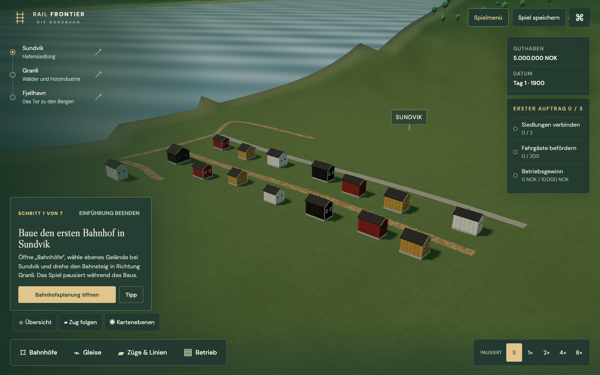 | 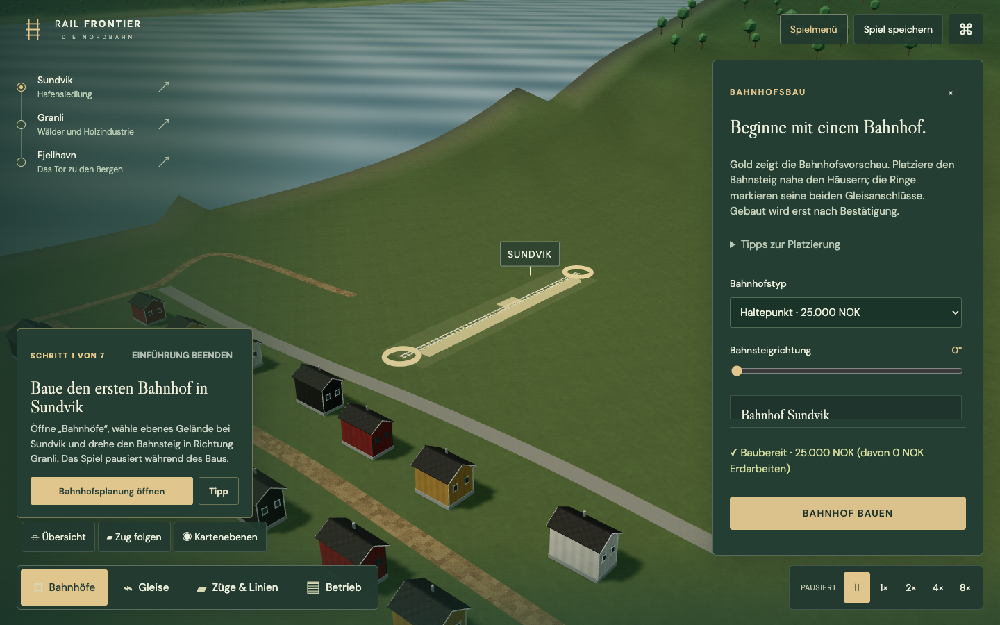 |

## September 21 update — languages, menus and mountain construction

The interface now supports **Deutsch and English**, including live language switching in Settings, the introduction, construction tools and the save/exit flow. Numbers, prices and dates follow the selected locale. Additional languages use JSON translation packs and one registry entry; see the [translation guide](docs/LOCALIZATION.md). Technical diagnostics and uncatalogued low-level errors may still fall back to English.

The main menu opens over the actual landscape. Choose **New game → Introduction** for a guided first company, **Free play**, or **Construction school** for four prepared railway challenges. A visible **Game menu** button offers settings and return to the main menu, with **Save & leave / Leave without saving / Keep playing**. Failed saves keep the company open. Stations, tracks, trains/lines and operations have separate bottom actions; camera and time controls sit separately. The station panel keeps its construction price and build button visible.

New tunnels need nine metres of cover; shallower sections become open cuts. Portals face outward and have an actual terrain opening, while retaining walls taper to local shoulder heights. Existing saved tunnel classifications remain intact. The fourth **highland** exercise introduces more pronounced relief and real bridge/tunnel choices; a connected campaign with staged unlocks remains planned.

For a running local server: [play in German](http://127.0.0.1:5173/?lang=de), [play in English](http://127.0.0.1:5173/?lang=en), [highland construction](http://127.0.0.1:5173/?draw-practice=1&lesson=highland&lang=de).

| Main menu over the Norwegian landscape | Safe return to the main menu |
| --- | --- |
| 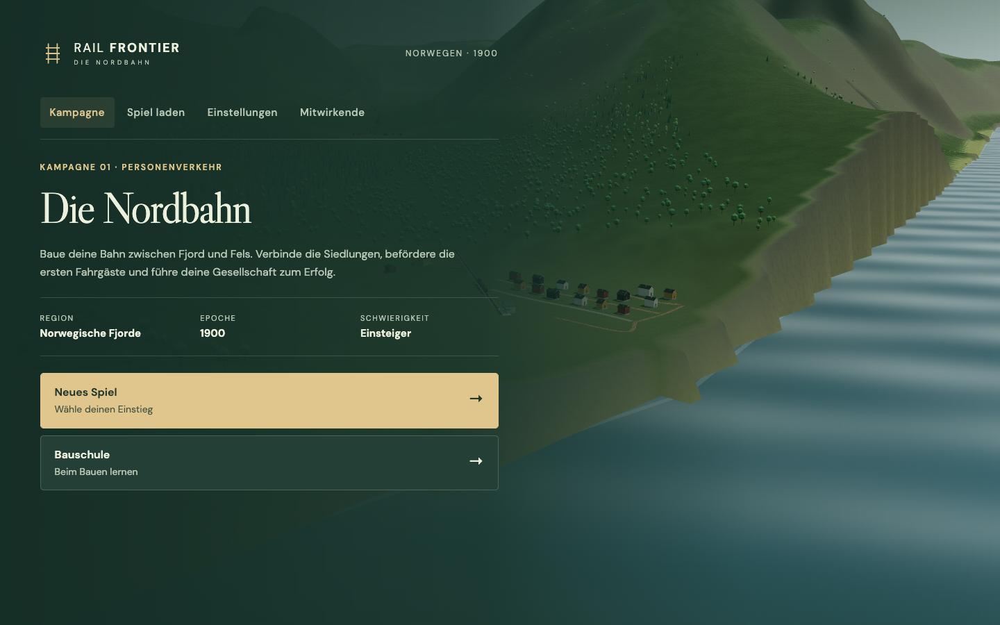 | 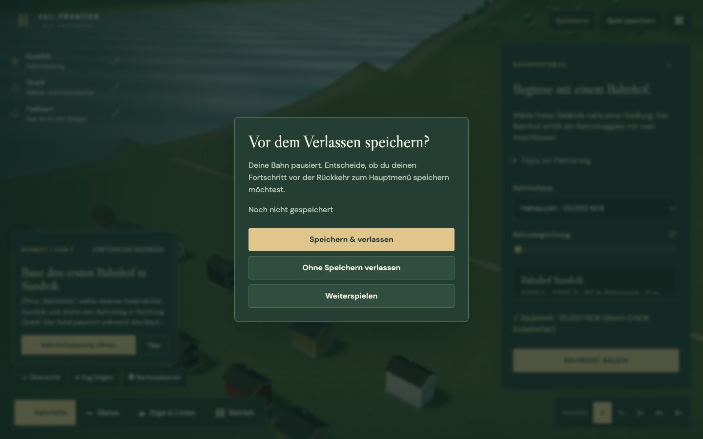 |
| Station placement and the guided introduction | Highland route planning |
|  | 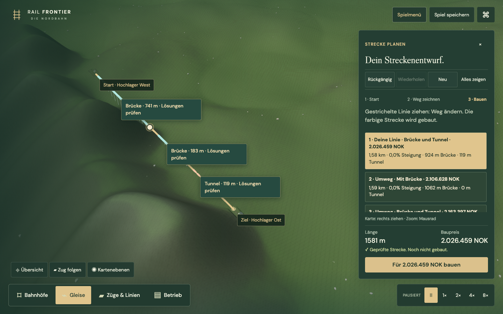 |

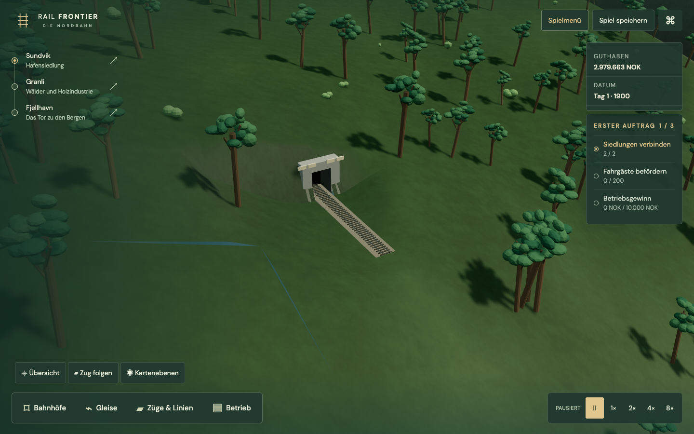

The new images come from the running game. Recreate them with `npx tsx tools/capture-ux-update.ts` while the development server is running.

## Try the new track drawing

**2026-09-21 playtest:** choose **Construction school / Bauschule → 1 · Along the valley** in the main menu. A separate practice company starts with two real stations in Norway; an active company is archived first. Click a named **Start here** station sign. Click or drag through the landscape to sketch your path; release anywhere and continue elsewhere. A live cursor line previews the next segment. Finish on the **Finish here** destination sign. Grab anywhere on the dashed sketch to reshape it, or use Undo/Redo. Right-drag pans the camera. No drawing-mode switch is needed.

The panel follows **Start → Draw path → Build**. Track standards sit under settings, and the purchase summary appears after choosing a destination. Named endpoints remain on the map; station selection keeps the camera in place. The first proposal and build button remain visible at 1280×720.

New normal companies start with **NOK 5 million**. Drawing practices start with **NOK 10 million before buying the two prepared stations**. Existing companies keep their current cash.

Try four construction exercises in order: **valley → inlet → mountain ridge → highlands**. After connecting the stations, continue to the next exercise in a new company; your current railway is saved first. Other exercises are also available under **Construction school / Bauschule** in the main menu. These are construction exercises on the real map, not completed campaign progression.

The game offers your drawn course first, then distinct alternatives with actual costs, gradients and structure lengths. Click a **bridge or tunnel marker** to compare solutions for that obstacle and its approaches. Other route sections remain unchanged. If the comparison spans the whole route, the panel says so. A mountain detour may shorten a tunnel without removing it entirely. Confirm the price to buy the exact reviewed geometry. Redrawing or starting a global wider search replaces the comparison list; Undo restores the previous design. The chosen design and draft history are included in company saves.

With the development server running: [valley drawing practice](http://127.0.0.1:5173/?draw-practice=1&lang=de), [inlet: bridge or land route](http://127.0.0.1:5173/?draw-practice=1&lesson=inlet&lang=de), [ridge: compare tunnels and detours](http://127.0.0.1:5173/?draw-practice=1&lesson=ridge&lang=de). The older illustrated prototype is not the game.

| Inlet crossing following the sketch | Ground route around the inlet |
| --- | --- |
| 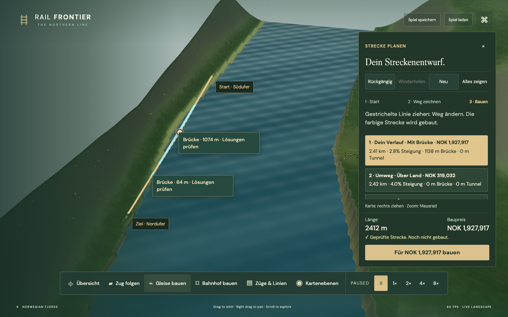 | 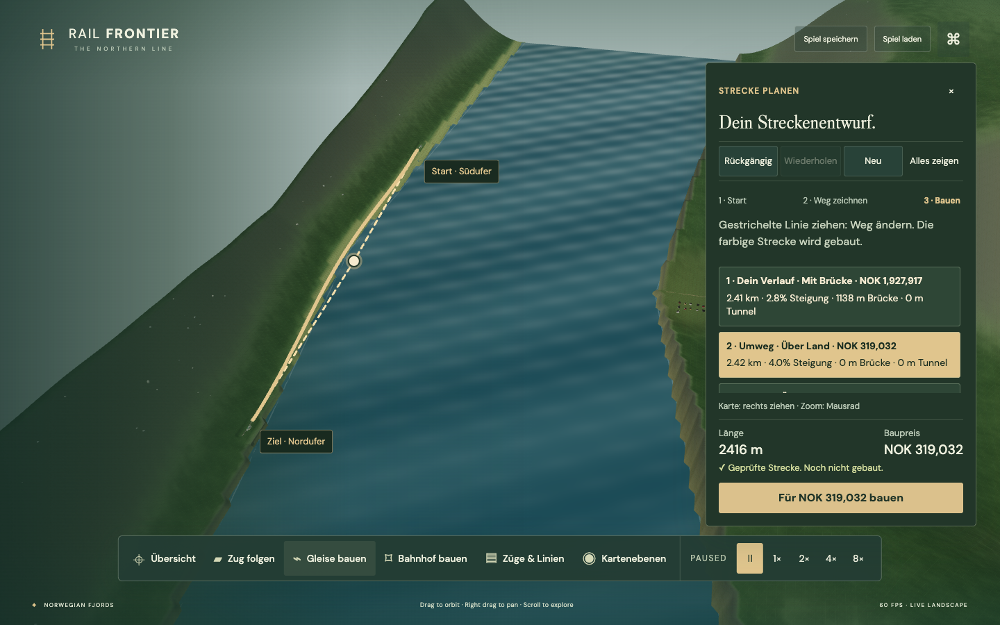 |

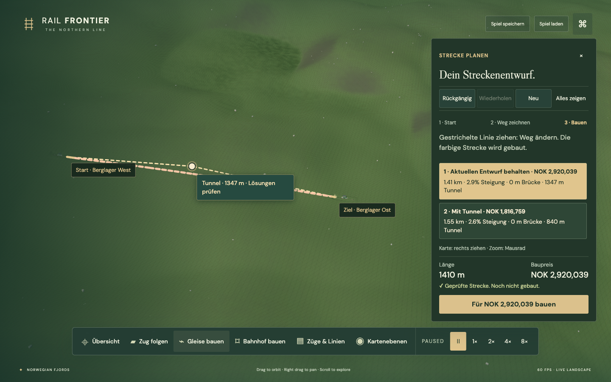

**Validation:** 178 core tests, TypeScript and production build; 14 distinct focused Chrome scenarios cover drawing/editing/keyboard/compact layouts, practice progression and archive, bridge/tunnel persistence, menu and language switching, tutorial flows, save/exit recovery and the full passenger/mail-revenue/save loop. Human playability acceptance and broader performance/accessibility work remain. The Norway V3 seabed bug is also fixed: water crossings now use genuinely submerged terrain.

## Current build

The Norway vertical slice is playable now. It has the complete build → station → consist → route → delivery → revenue loop, passenger, mail and timber traffic, town growth, objectives, save archives and safe single-track dispatch. Corrected roofs, settlement-scale opening cameras, natural terrain materials, camera-aware vegetation and Norway V3 landmark cliffs/waterfall have landed. Arizona V2 geology and original circa-1900 architecture are complete. Semantic construction terrain, retaining walls, exact bridge/tunnel transitions, the engineering profile and worker-based route alternatives are implemented. The guided first-service builder and optional seven-step hands-on introduction now run through the real construction and operating commands. Active-step resume, archive import and storage-failure preservation are covered. Repeating the lesson creates named current-company and practice slots; the Railway Office introduces upgrades, reports, freight and electrification after the first real passenger delivery. Automated integrated acceptance is complete; an unassisted first-time human playtest, deployment, supported browser/device checks and permanent released-save upgrade fixtures follow.

An isolated Arizona terrain and scenery study is also available at `http://127.0.0.1:5173/?skip-menu=1&world=arizona`. Its current heightfield previews a 24 km basin with irregular stepped mesas, broken escarpments, talus and connected meandering canyon branches, plus desert materials and habitat-based procedural vegetation, without the Norway HUD. Ten original Blender building types replace the former boxes across three composed settlements, with gabled, hipped, adobe, false-front and railway/industrial forms. Arizona gameplay, US rolling stock and campaign selection follow later in EXP-004/005.

**2026-09-20 implementation update:** CON-01–06 deliver station-first placement, continuous horizontal/vertical alignment planning, deterministic terrain earthworks, quoted station pads, engineering review and terrain-aware corridor alternatives. The original corridor foundation includes a capped coarse-to-fine heading/elevation lattice. The new drawn-route slice currently uses bounded wish-path fits through the same cancellable worker and live-terrain certification boundary; full ordered-corridor search remains planned. UX-003 adds the guided first-service builder and honest pre-purchase checks for budget, connection, platform length and electric power. The first CON-07 slice adds a persisted seven-step introduction, real-action evidence, guided/free-play starts and lossless dismissal. GFX-R03–07 provide natural terrain materials, camera-aware vegetation, Norway V3 cliffs/waterfall, Arizona V2 geology and 20 original Arizona architecture GLBs across 180 deterministic building plots.

Historical validation around runtime checkpoint `e70bddd` recorded 164 active Node tests and coverage of 26 browser scenarios: guided/free-play/dismiss/active-step-resume/practice-company flows, the service-builder journey, Norway and Arizona landform/material/architecture checks, semantic construction, repeated current-scene replacement and full passenger/mail/freight/save journeys. TypeScript, asset validation and the production build also pass. Schema 9 persists the optional learning state and migrates all schema-8 companies to no active tutorial. Tutorial archives preserve active evidence, failed storage writes leave it untouched, and loading reconciles it against real entities before display. Schema 8 terrain data still rebuilds station pads and alignment earthworks deterministically over the immutable base terrain.

| Norwegian fjord landscape and live HUD | Steam passenger service |
| --- | --- |
|  |  |
| Sundvik station and timber village | Landscape and motion settings |
|  |  |
| Engineering review and build quote | Arizona V2 settlement street |
| 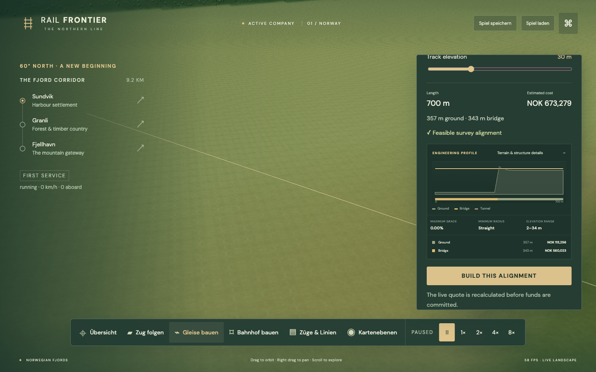 | 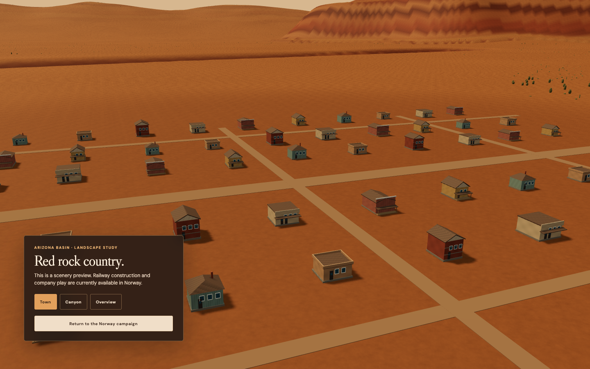 |
| Arizona V2 canyon landscape | |
| 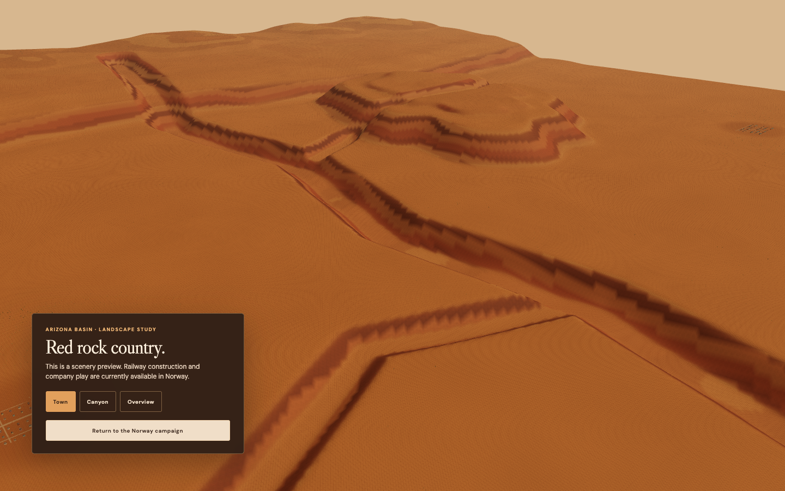 | |

| Guided first-service builder |
| --- |
| 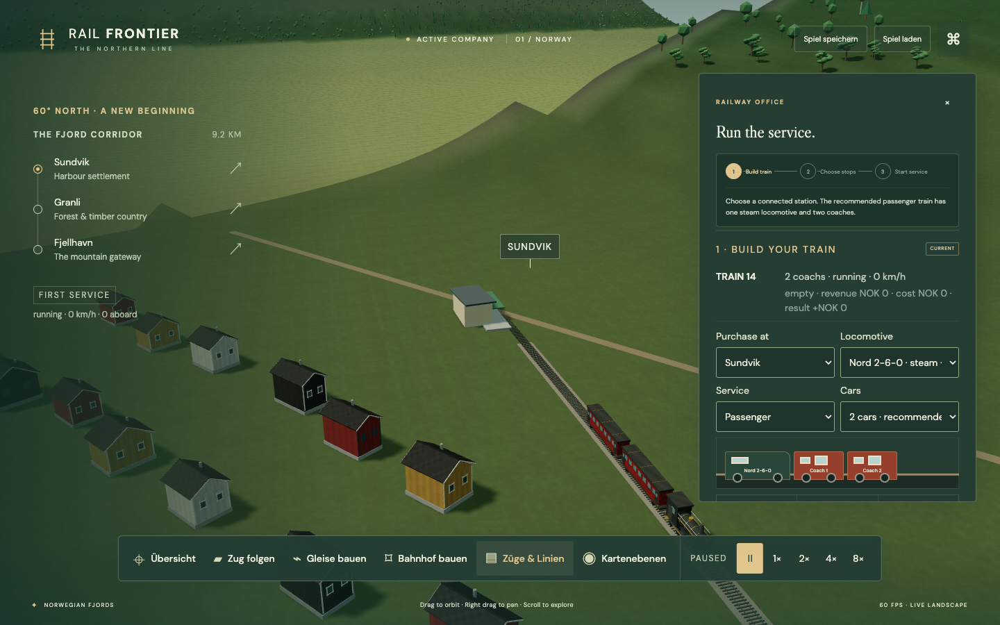 |

| Optional hands-on introduction |
| --- |
| 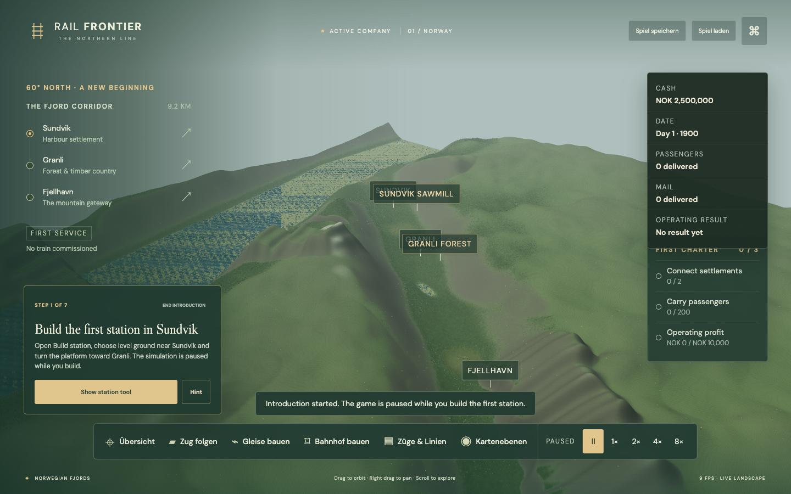 |

| First revenue and the next railway tools |
| --- |
| 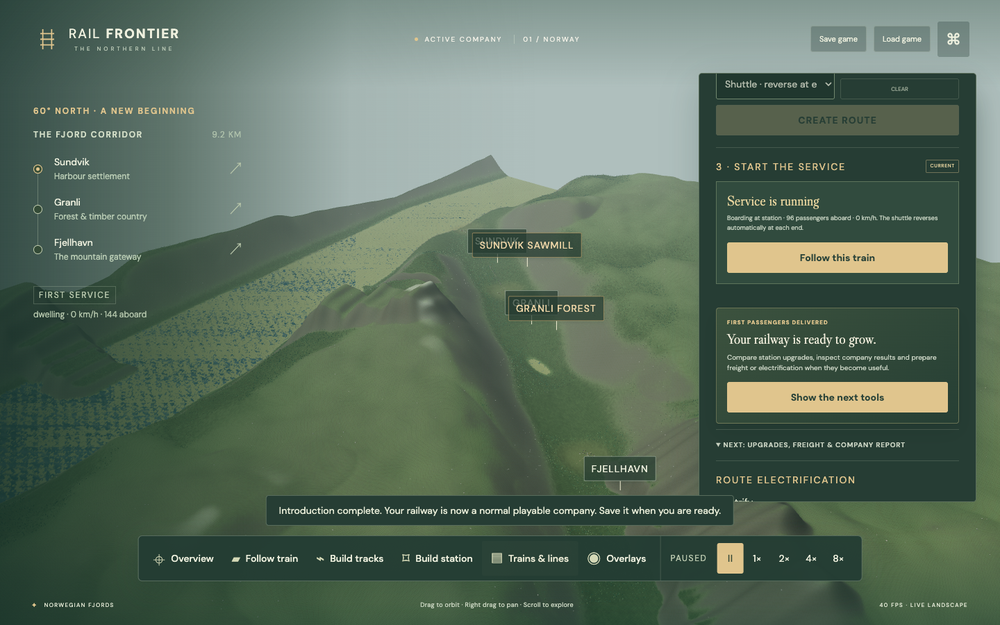 |

## Run

Node ≥22.12 and npm required. Tested on Apple M2 Pro with Node 25.8.0, npm 11.11.0 and Chrome 153.

```sh
npm ci
npm run dev
```

Open http://127.0.0.1:5173. Drag to orbit, right-drag to pan, scroll to zoom; WASD pans. F follows the train, R restores the regional camera, Space pauses/resumes, and Escape closes the active panel. Map labels and rendered trains/stations open live detail cards. The Operations panel reports cash, monthly results, infrastructure and owned-asset value, plus train and route profitability. The Overlays panel shows station catchments, industry sites and current track reservations. Background tabs pause explicitly. Save/load persists the company to IndexedDB; the company archive can export and import portable `.railfrontier.json` backups.

### First company

1. Choose **Build station**. Click suitable ground near Sundvik, rotate the platform toward Granli and build. The preview shows the platform footprint, internal track and both connection rings.
2. Build a second station near Granli and point it along the same corridor.
3. Choose **Build tracks**, click the named starting station and sketch by clicking or dragging through the landscape. Finish on the destination station sign. Drag the dashed line to reshape it, compare bridge/tunnel solutions and confirm the construction price. **Undo/Redo** revises the sketch; right-drag pans the camera. Track standards are under the optional settings disclosure.
4. Open **Trains & lines**, buy a locomotive with one or more cars, add both stations as ordered stops, create the route and assign the train.
5. Run at 4× or 8× and watch passengers, mail, freight and company results. Save from the header or create a named archive slot in the main menu.

The commissioned preview already contains a legacy three-station railway and a passenger train. **Start new company** opens the new station-first construction flow.

The diagnostics button exposes tree visibility and a clearly identified rendering stress scene. Debug programmatic inspection is available only in development builds. The visible shell is an early playable interface and remains subject to release polish.

## Validate and build

```sh
npm run check
npm test
npm run validate:assets
npm run test:browser
npm run spike
npm run spike:network
npm run build
npm run preview
```

Browser tests require installed Google Chrome (Playwright channel chrome). They build and serve a static test-mode bundle on port 5173; the normal preview serves on port 4173. No deployment configured or performed. Font assets are bundled locally. The Three.js chunk produces Vite's normal size advisory and remains within the current compressed download budget.

General README screenshots are captured from the running application with `npm run screenshots:readme`; the new terrain-choice images use `npx tsx tools/capture-construction-lessons.ts`. Set `RAIL_FRONTIER_URL` to capture a server other than `http://127.0.0.1:5173`.

## Reproduce Blender assets

Blender is optional to run tests because the small runtime GLBs are tracked. Tested generator: Blender 4.0.2 / Python 3.10.13.

```sh
"/Applications/Blender.app/Contents/MacOS/Blender" --background --factory-startup --python tools/blender/generate_norway_pack.py
npm run validate:assets
```

Use the matching local Blender executable on other platforms. [ASSET_PIPELINE.md](ASSET_PIPELINE.md) defines units, axes, materials, naming, LOD and validation.

## Continue in Sol

Read [CURRENT_STATUS.md](CURRENT_STATUS.md), [IMPLEMENTATION_PLAN.md](IMPLEMENTATION_PLAN.md), [ARCHITECTURE.md](ARCHITECTURE.md), [DATA_MODEL.md](DATA_MODEL.md), [ECONOMIC_CONTRACT.md](ECONOMIC_CONTRACT.md), [SAVEGAME_FORMAT.md](SAVEGAME_FORMAT.md), [DECISIONS.md](DECISIONS.md) and [ASSET_PIPELINE.md](ASSET_PIPELINE.md). The active renderer is `src/rendering/fjord-renderer.ts`; the small study fixtures remain isolated under `spikes/`.

Tests: [TESTING.md](TESTING.md). Measured limits: [PERFORMANCE.md](PERFORMANCE.md). Engine evidence: [RENDERING_CAPABILITIES.md](RENDERING_CAPABILITIES.md). Dependency/art attribution: [THIRD_PARTY_NOTICES.md](THIRD_PARTY_NOTICES.md).
