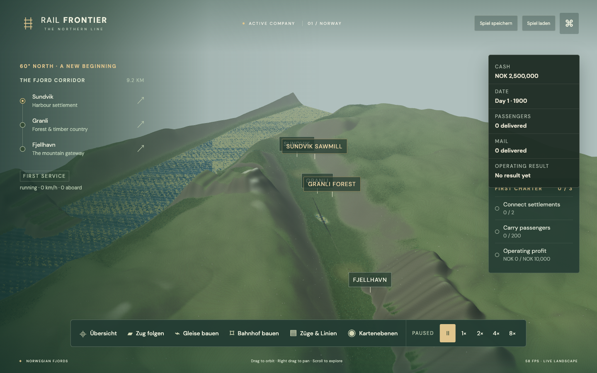
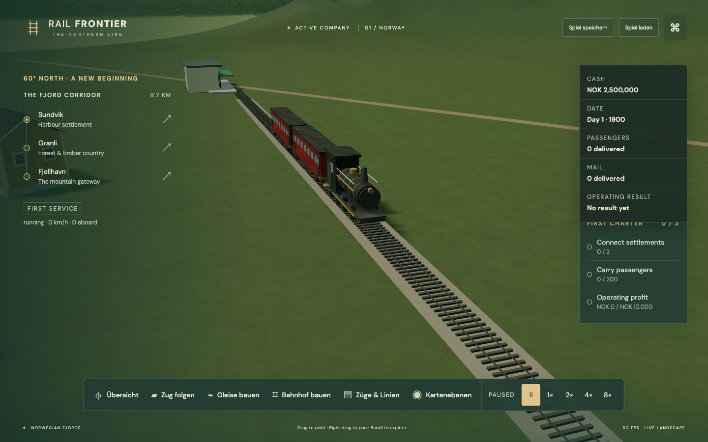
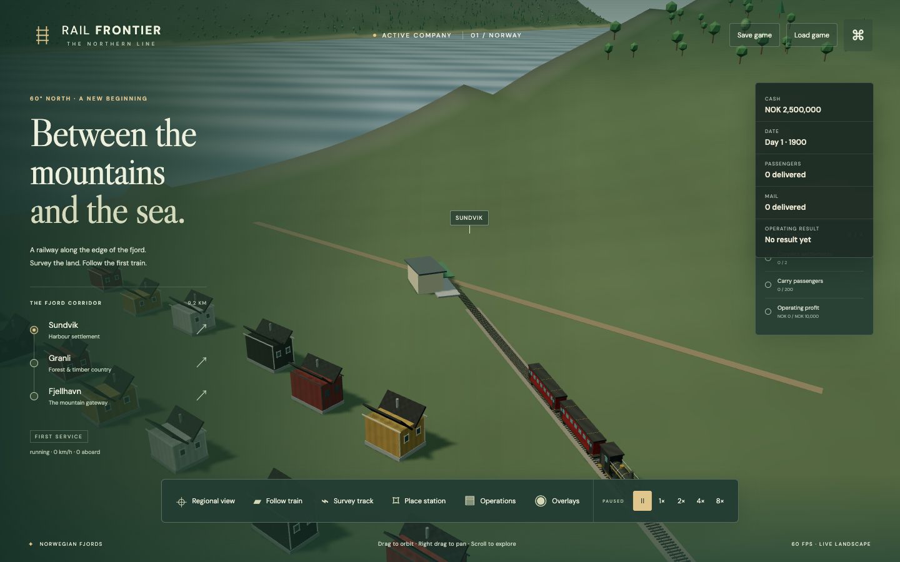
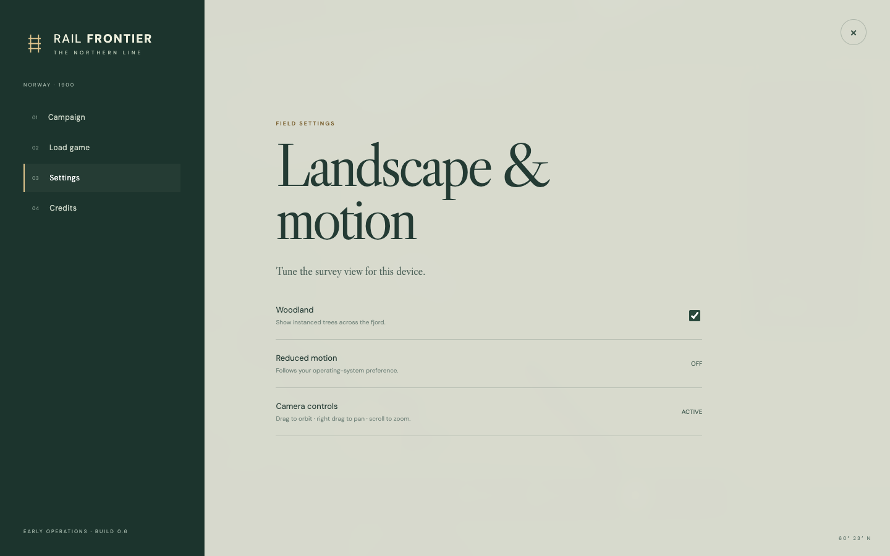

# Rail Frontier

Original browser-based single-player railroad strategy game. Build networks through Norwegian fjords, then expand the same systems to Arizona and great river landscapes. MIT licensed.

**Current milestone: the Norway passenger, mail, timber-freight, first town-economy, management-reporting, electrification, graphics, portable-save and safe-dispatch gates are complete.** The browser runs the atomic game application across the generated 16 km fjord. Players can build track and six progressively larger station classes, upgrade stations, buy passenger or freight consists from a year-aware vehicle catalogue, create ordered shuttle or loop routes, electrify routes, carry people, mail and timber, grow connected towns, inspect live trains/stations/towns/industries, compare company/train/route profitability, read three map overlays, import/export save archives and complete campaign objectives. Station-to-station path reservations keep opposing trains outside occupied single-track corridors. The production scene uses an original two-LOD Blender pack with mixed Norwegian vegetation and rocks, timber settlements, industries, detailed current rolling stock and researched El 1, Di 3B, Di 4 and El 18 era locomotives; electrified edges visibly gain overhead-line portals and wires.

Astra and Sol refer to Codex models. The actual rendering engine is **Three.js**, with TypeScript and Vite. The required Astra → Sol handoff is documented in [CURRENT_STATUS.md](CURRENT_STATUS.md).

## Current build

The Norway vertical slice is playable now. It has the complete build → station → consist → route → delivery → revenue loop, passenger, mail and timber traffic, town growth, objectives, save archives and safe single-track dispatch. The next public-alpha step is release hardening: publish the static build, define the supported browser/device matrix, keep permanent released-save upgrade fixtures and complete a focused onboarding/accessibility/manual-QA pass. Arizona and Great River are later content expansions and do not block a first Norway release.

An isolated Arizona terrain study is also available at `http://127.0.0.1:5173/?skip-menu=1&world=arizona`. It previews the versioned 24 km basin, plateau, mesas, canyon, desert materials and procedural vegetation without the Norway HUD. Arizona gameplay and original Blender assets follow in EXP-004/005.

The latest checkpoint passes 120 Node tests and 19 real-Chrome journeys in addition to TypeScript, asset and production-build validation.

| Norwegian fjord landscape and live HUD | Steam passenger service |
| --- | --- |
|  |  |
| Sundvik station and timber village | Landscape and motion settings |
|  |  |

## Run

Node ≥22.12 and npm required. Tested on Apple M2 Pro with Node 25.8.0, npm 11.11.0 and Chrome 153.

```sh
npm ci
npm run dev
```

Open http://127.0.0.1:5173. Drag to orbit, right-drag to pan, scroll to zoom; WASD pans. F follows the train, R restores the regional camera, Space pauses/resumes, and Escape closes the active panel. Map labels and rendered trains/stations open live detail cards. The Operations panel reports cash, monthly results, infrastructure and owned-asset value, plus train and route profitability. The Overlays panel shows station catchments, industry sites and current track reservations. Background tabs pause explicitly. Save/load persists the company to IndexedDB; the company archive can export and import portable `.railfrontier.json` backups.

### First company

1. Choose **Survey track**, select **Choose two points on the map**, and click near two settlements. Review the quote and build the alignment.
2. Choose **Place station**. Select each free rail endpoint from **Build at**, choose a station class and build. Stations currently require an endpoint or junction; extend the track to create another build point.
3. Open **Operations**, buy a consist at a station, add at least two ordered stops, create the route and assign the train.
4. Run at 4× or 8× and watch passengers, mail, freight and company results. Save from the header or create a named archive slot in the main menu.

The commissioned preview already contains a three-station railway and a passenger train. If every build point is occupied, extend the line before placing another station.

The diagnostics button exposes tree visibility and a clearly identified rendering stress scene. Debug programmatic inspection is available only in development builds. The visible shell is an early playable interface and remains subject to release polish.

## Validate and build

```sh
npm run check
npm test
npm run validate:assets
npm run test:browser
npm run spike
npm run spike:network
npm run build
npm run preview
```

Browser tests require installed Google Chrome (Playwright channel chrome). They start/reuse the local Vite server. Build emits a static site in dist; preview serves on port 4173. No deployment configured or performed. Font assets are bundled locally. The 640.71 KB Three.js chunk produces Vite's normal size advisory; 160.48 KB gzip, within the current total download budget.

README screenshots are captured from the running application with `npm run screenshots:readme`. Set `RAIL_FRONTIER_URL` to capture a server other than `http://127.0.0.1:5173`.

## Reproduce Blender assets

Blender is optional to run tests because the small runtime GLBs are tracked. Tested generator: Blender 4.0.2 / Python 3.10.13.

```sh
"/Applications/Blender.app/Contents/MacOS/Blender" --background --factory-startup --python tools/blender/generate_norway_pack.py
npm run validate:assets
```

Use the matching local Blender executable on other platforms. [ASSET_PIPELINE.md](ASSET_PIPELINE.md) defines units, axes, materials, naming, LOD and validation.

## Continue in Sol

Read [CURRENT_STATUS.md](CURRENT_STATUS.md), [IMPLEMENTATION_PLAN.md](IMPLEMENTATION_PLAN.md), [ARCHITECTURE.md](ARCHITECTURE.md), [DATA_MODEL.md](DATA_MODEL.md), [ECONOMIC_CONTRACT.md](ECONOMIC_CONTRACT.md), [SAVEGAME_FORMAT.md](SAVEGAME_FORMAT.md), [DECISIONS.md](DECISIONS.md) and [ASSET_PIPELINE.md](ASSET_PIPELINE.md). The active renderer is `src/rendering/fjord-renderer.ts`; the small study fixtures remain isolated under `spikes/`.

Tests: [TESTING.md](TESTING.md). Measured limits: [PERFORMANCE.md](PERFORMANCE.md). Engine evidence: [RENDERING_CAPABILITIES.md](RENDERING_CAPABILITIES.md). Dependency/art attribution: [THIRD_PARTY_NOTICES.md](THIRD_PARTY_NOTICES.md).
