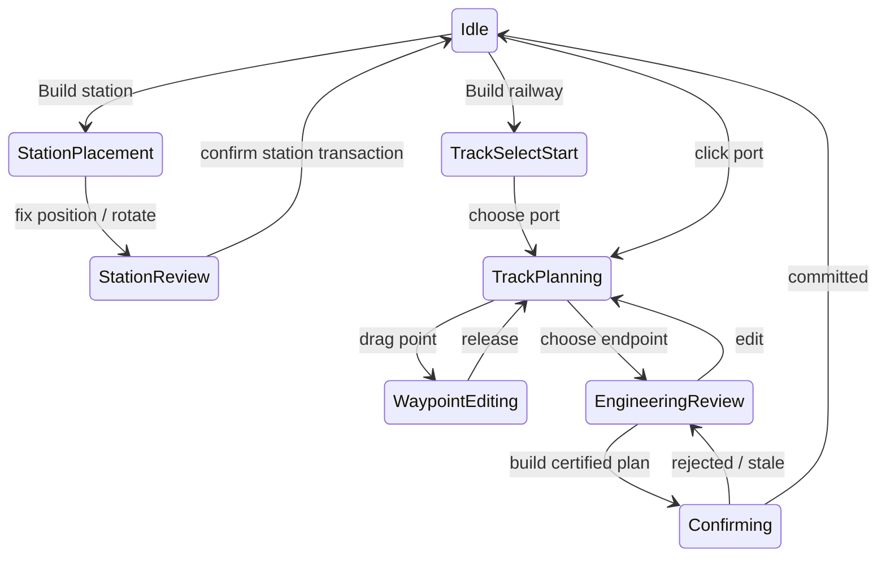

# Station-first railway construction: architecture and implementation brief

Date: 2026-09-20. Status: **architecture/design complete; CON-01–05 implemented; CON-06 route alternatives next**. This document implements the design request in the [user's preserved construction brief](USER_CONSTRUCTION_BRIEF.md), sections 1–57. Standalone oriented stations own level platform track and stable ports; save schema 8 also persists semantic station pads and alignment earthworks. The live construction tool supports optional waypoints, smooth horizontal/vertical cubic sections, level port approaches, three track standards, undo/cancel and one atomic multi-section purchase.

This **supersedes UX-002's track-first workflow, two-click-only scope and deferred waypoint editing**. The user wants to plan railway infrastructure from stations, with editable continuous alignments, engineering and strategic cost/performance tradeoffs. The [graphics rework](../art/GRAPHICS_REWORK_PLAN.md) and [readability/tutorial plan](../ux/ONBOARDING_AND_CONTROLS_PLAN.md) remain active and are integrated below.

## 1. Repository audit and reuse

| Boundary / inspected files | Current implementation | Reuse / necessary change |
| --- | --- | --- |
| `src/main.ts`, `src/ui/study.css`, `package.json` | Vanilla TypeScript DOM and CSS, Vite, Three.js; no React UI. Tool booleans and forms in the main module. | Extract a construction reducer/controller and render its state in the existing DOM. Keep UX-001 readable controls and language settings. |
| `src/rendering/fjord-renderer.ts`, camera presets | OrbitControls plus keyboard navigation, world ray picks, scene entities and overlays. Right mouse is owned by OrbitControls by default. | Explicit input ownership in build mode; keep camera controller outside geometry/economy. |
| `src/domain/model.ts` | SI metres, X east / Y up / Z south, integer minor currency units. RailGraph with node IDs and cubic 3D Bézier edges. Station points at one graph node. | Preserve existing IDs, units and cubic edges. Add station layouts/ports, construction records and versioned rules. Do not create a second railway graph. |
| `src/rail/geometry.ts`, `constraints.ts`, `domain/curve-math.ts` | Arc-length compilation, distance sampling, derivatives, conservative grade/radius/cusp certificates and polynomial root helpers. Default 4% / 100 m; some error text hardcodes 4%. | Reuse kernels; add a chain solver and cross-section/join certificates. Pass track-class limits through all checks and remove hardcoded error text. |
| `src/rail/planner.ts` | Exact triangle/water/classification boundary subdivision for one supplied curve. Fixed -4/+6 m cutoffs and three span types; no corridor search or height-profile optimizer. | Extend quotation/classification around existing root analysis. It is currently a validator/pricer, not an automatic alignment solver. |
| `src/application/construction.ts` | One-curve command with atomic graph edit, exact quote/revision/funds check, terminal tangents and edge splitting. Splits used by a train path or reservation are rejected. | Extract shared dry-run graph edits; add one multi-section alignment command. Keep current split protection. Never call the existing command N times to build one route. |
| `application/stations.ts`, `content/stations.ts` | Six station classes; must use an existing ground-level connected node; no orientation/footprint/ports. | Add free placement, station pad and real station track. Keep classes and compatible legacy upgrades. |
| `application/game.ts`, `commands.ts`, `simulation/finance.ts` | Clone → validate → commit; exact command sequence; integer ledger; immutable snapshots. Terrain is currently a readonly external object. | Reuse state transaction. Stage terrain changes with the candidate state; external terrain mutation inside a handler would break atomicity. |
| `world/terrain.ts`, generators, `application/session-host.ts` | Immutable triangular Heightfield, exact `planeAt` / `curveBreakpoints`, versioned worlds; session host explicitly expects Heightfield. | Preserve base generators. Add a triangle-surface capability and deterministic local earthwork overlay. Remove concrete `instanceof Heightfield` dependencies where needed. |
| `rail/graph.ts`, `simulation/trains.ts`, `occupancy.ts` | Immutable adjacency/path cache by revision; graph edges priced by length/speed for operational pathfinding; grade-driven traction and full-leg reservations. | Operational pathfinding remains here. Terrain corridor search is a separate planning problem. Add braking anticipation for new curve speed limits; reuse traction and reservations. |
| `application/trains.ts`, `routes.ts`, `simulation/coverage.ts` | Purchases use adjacent track; coverage considers any station in range, including potential future isolated stations. Routes use station node IDs. | A station's internal rails must not unlock a usable service or steal catchment from a served station. Centralize connection/coverage eligibility. |
| `persistence/save.ts`, application saves / IndexedDB | Strict schema 8, sequential migrations 1–8, bounded import, graph/cost/path/terrain validation. Schema 7 owns station layout, ports and historic construction cost; schema 8 owns semantic terrain operations. | Add later migrations explicitly, with strict new references and collection caps. Preserve original curves, paths, spans and historic costs on old saves. |
| `rendering/track-mesh.ts`, portals/trusses in renderer | Derived rails/ballast/sleepers, heuristic supports from clearance. Renderer also builds portals and trusses. | Render from authoritative classified spans; eliminate competing support/portal classifications. Use lightweight ghosts during editing. |
| `tools/blender/*`, runtime pack, `ASSET_PIPELINE.md` | Local Blender 4.0.2 produces GLB modules. Runtime +Y up differs from Blender +Z up; conversion is already established. | Blender for platforms, buildings, buffers, piers, decks, portal/retaining modules. Dynamic rail alignment and terrain stay procedural. |

Current checkpoint tests: 149 Node tests plus focused Chrome construction and complete asset/camera/save journeys. Station-first placement, a live waypoint plus undo, continuous vertical profile, class/rules revalidation, advance braking, port connection, one atomic multi-section command, persisted earthworks, quoted moderate-slope station pads, triangle-identical rendered terrain, exact bridge/tunnel boundaries, retaining walls, coherent multi-edge transitions, combined-chain engineering profile/cost review, revenue and exact reload are covered.

## 2. Decisions and user-facing flow

1. **Build Station A first.** `Bauen → Bahnhof`; ghost follows terrain; click fixes position; rotate with visible buttons or Q/E; confirm cost. Preview type, town/industry, approximate catchment, orientation/approaches, pad suitability and warning reason.
2. **Choose destination.** For the first lesson, build Station B near Granli using the same flow. Alternatively during route planning select an unserved town, suspend the draft and place its destination station, then resume. Cancelling station placement restores the suspended draft; constructing it is a separate visible purchase.
3. **Start at A's connection handle.** `Bauen → Strecke` can also prompt selection of a handle. Highlight compatible outgoing directions. A ghost alignment follows the pointer.
4. **Shape the railway.** Left click adds a waypoint; drag a waypoint to revise; compatible station/rail target finishes the draft. Right click removes the latest waypoint or cancels if none remain; Escape cancels the draft. Use a visible **Endpunkt setzen** action rather than ambiguous double-click in the first release; double-click is optional in the user's brief.
5. **Review.** Length, price, maximum gradient, tightest radius, bridge/tunnel totals and validity stay visible. Details open an elevation profile and cost breakdown. Edit without expenditure; only a fully checked result enables **Strecke bauen**.
6. **Construct.** One confirmed alignment transaction spends once and inserts every approved section, earthwork and structure. Existing stations have already been paid for and are not charged again.
7. **Operate.** Once a usable station-to-station path exists, show **Zug zusammenstellen** and reuse the locomotive/wagon, line and service sequence in UX-003.

Always distinguish **Strecke** (physical railway) from **Linie** (train service and stopping order). The construction Build action must never dispatch `createRoute` accidentally. Isolated purchased stations show **Noch nicht verbunden**, with upkeep disclosed. Town/industry hints do not invent railway connectivity.

Input arbitration: the construction controller owns left/right mouse on the world canvas while active. Disable corresponding OrbitControls bindings for that mode. Middle-drag pans; Alt+left-drag or explicit camera buttons orbit, with a visible help hint. Scroll zoom remains; scrolling UI never zooms the world. Restore camera bindings on exit, blur, pointer cancellation and session replacement. A waypoint drag must not also add a point on release. Escape in an open field/menu first closes that UI. Keyboard Add/Remove and named target lists are equivalent to map actions; touch uses explicit undo/cancel buttons.

## 3. Semantic data and station topology

### One graph, finite station tracks

Keep `RailEdge.curve: CubicCurve` as the authoritative constructed centerline and `Station.nodeId` as the operational stopping node. Add `Station.layout` as a discriminated record:

- `legacy-node`: current node, stable orientation metadata derived from existing incident geometry where possible, compatible virtual attachment handles at that same node. No fabricated distance, new edges, terrain pads or changed arrival point during migration.
- `single-platform`: center stop node, two real port nodes, two straight internal track edges from the center to the ports, orientation, versioned footprint/pad reference and physical usable platform length. Ports are at the actual ends of the reserved straight station track; their outward headings and level rail heights are exact solver boundary conditions.

The station therefore exists on the semantic graph before any connecting line. Internal rails are real finite lengths, included in train motion and reservations. They are paid as part of the station package, tagged as station-owned infrastructure, and not billed/maintained again as independent track. Historic station purchase/pad cost is recorded for new stations; report ownership through one cost source, not two.

`StationPort` uses stable station-owned keys, an actual `nodeId`, outward tangent, permitted track class/gauge and attachment capacity. Connected edge IDs are derived from the graph, not a second editable list. The initial layout has one external connection per port. More platforms/throats later extend this layout contract.

Purchase/coverage eligibility distinguishes physical catchment from transport service: show potential coverage for isolated stations, but exclude them from demand/freight assignment until a usable external operational connection exists. An isolated station with only its own internal edges cannot steal traffic or enable train purchase. Existing connected stations retain their previous eligibility. For first-service readiness require a traversable connection to a second distinct station, not merely nonzero node degree.

Station footprint includes tracks, platform, building and short approach clearance. Check the entire footprint and graded pad, not only the center. Initial flat-site station placement may reject excessive slope while offering nearby valid sites; CON-04 adds quoted pad cut/fill. No bridges, underwater station pads or automatic demolition. Decorative scenery can be cleared by a saved exclusion; towns and industries remain protected semantic sites. Rotating after purchase is a rebuild operation and is not free drag editing.

Keep the six existing classes. For new-layout upgrades, expanded platform capacity must fit actual straight track and a validated pad. If extension would require moving connected ports, offer a reconstruction requirement and reject that upgrade until supported. Do not grant a longer platform that visually/physically cannot exist. Legacy station upgrades retain their existing semantics rather than retroactively requiring new pads.

### Constructed alignment record

Add a construction identity (`alignment` ID through the existing allocator), referenced by new edge infrastructure records. Store ordered section edge IDs, original planning anchors, solver/rules versions, selected track class/mode, accepted cost breakdown, construction state and earthwork references. The cubic edges are authoritative for movement and rebuilding meshes. Intent is retained for inspection/future editing, never re-solved during load. Horizontal X/Z and vertical Y control components are separable projections of the saved cubic; do not also persist an independent conflicting centerline.

Infrastructure spans expand to `ground`, `embankment`, `cutting`, `bridge`, `tunnel`, `station`. Each span uses cumulative 3D distance on its edge, stable classification/rules version and typed metadata (deck/clearance, portal/cover, cross-section, unit-rate version). Adjacent sections belonging to the same structure also reference a structure record spanning edges so one tunnel does not acquire a portal at every Bézier join.

Track class data supplies max/design speed, max/preferred grade, min/preferred horizontal radius, vertical curvature limit, clearance/cross-section, gauge, spacing, electrification support and rates. All SI except presentation. Preserve current built-edge speeds and `legacy-v1` rules; new class balances are game parameters, not assertions of civil-engineering compliance. Start with one local railway class, expose higher-spec choices when useful. Existing electrification stays implemented; do not re-defer it because the user lists it among future features.

## 4. Tool and construction state machines

Every noncommitting tool state supports cancel; StationReview can return to StationPlacement. A typed suspended-track context handles destination-station placement without destroying its anchors. Planning session owns draft anchors, undo history, selection, mode, request revision and result status (`approximate`, `solving`, `certified`, `invalid`, `cancelled`, `budget-exceeded`). UI state never owns live economic or terrain objects.

Infrastructure lifecycle is distinct: `PLANNED → APPROVED → UNDER_CONSTRUCTION → OPERATIONAL`. Initially the final three transitions occur inside the successful transaction and only the operational result is published. A short construction reveal is cosmetic and skippable, not a timer granting incomplete rails to trains. Future timed construction will persist projects and expose only operational sections to routing; unsupported unfinished projects are rejected by the initial save reader. Cancelling a plan spends nothing; cancelling after an accepted build does not refund construction. Undo/redo applies to draft actions, not arbitrary economic rollback.

## 5. Horizontal solver and compatibility with current cubics

Implement `alignment-solver.ts` as a pure bounded solver. Fixed anchors include positions; start/end ports additionally constrain headings and elevation/grade. User waypoints are fixed plan-view pass-through constraints until moved; they do not force rail elevation to the terrain. A waypoint may consequently lie above a valley or under a mountain. Soft guides may be a later explicit mode, never silently move a fixed point.

1. Remove/reject coincident or too-close anchors with a visible reason. Estimate interior tangents from neighboring chord directions; use exact outward start and inward end port directions. Detect hairpins/opposed constraints early.
2. Form cubic Hermite segments in X/Z and convert to Bézier controls. Optimize shared tangent directions and handle lengths with deterministic bounded coordinate search. Penalize departure from the intended corridor, curvature and excess length; maintain endpoint/anchor equality. Bound handles to prevent loops and convex-hull escape.
3. At segment joins use aligned derivatives with compatible scales, no sharp plan-view corners. Certify all horizontal segments and join direction; reject cusp/self-intersection and tight-curve cases rather than merely painting a smooth-looking rail. A bounded search can fail to find a feasible alignment; report **Keine passende Kurve gefunden. Wegpunkt verschieben** rather than claiming none exists mathematically.
4. Fit the vertical profile independently (next section), then emit a chain of ordinary 3D cubics. Each edge uses a real graph node at its endpoints; internal degree-2 joins are not implicit junction choices.
5. Share exactly the emitted chain between preview, certification, quote and commit. Keep the existing cubic compiler and conservative validation, plus new vertical/join checks. No blind Catmull-Rom overshoot and no separate renderer spline.

Future transition curves/clothoids can be lowered to certified cubic sections with an explicit approximation tolerance and version; they do not require changing the operational graph today.

## 6. Vertical profile solver and speed

Compute cumulative **horizontal** chainage `s` along X/Z using adaptive integration. Sample existing terrain at 5–10 m for profile design, refine around water/triangle boundaries, ports and abrupt relief. Samples help search; final approval still uses exact/conservative geometry checks. Use horizontal distance for grade and vertical curvature; 3D rail distance for fares, length and motion. Do not confuse those measures.

Vertical design chooses elevation `h(s)` subject to endpoint rail levels, grade at ports (level for a new station), `|dh/ds| ≤ class.maxGradient` and `|d²h/ds²| ≤ class.verticalCurvatureLimit`. Preferred grade and cut/fill/structures enter the objective. Early feasibility checks include required elevation change versus available horizontal distance; inability to descend is not solved by clamping heights.

Use bounded dynamic programming over stationing with elevation and grade bins, preserving exact endpoint states. Transition cost estimates track/earthwork/bridge/tunnel plus grade and grade-change penalties. Coarse pass narrows an elevation corridor; refine surviving alternatives at smaller chainage/height spacing. Search bands derive from fixed heights, grade cones and structure limits, and are capped; an exhausted budget is an explicit unresolved result, never a buildable fallback. Stable iteration order and tie-breaking keep results deterministic. Budget and bin settings belong to solver-version data. This handles nonconvex bridge/tunnel thresholds more directly than assuming a single convex terrain-following fit.

Smooth the selected profile using shared-grade cubic Hermite spans in `s`, limiting overshoot and checking derivative extrema. To retain existing 3D cubic infrastructure, subdivide horizontal segments as needed and fit Y controls to profile endpoint heights and grades: `dy/dt = (dh/ds) * |d(X,Z)/dt|` at endpoints. Bound the vertical fit error (initial target ≤0.02 m) and re-certify grade, vertical curvature and tangent continuity on the resulting 3D chain. Profile extrema/curvature between samples need interval bounds; if subdivision cannot certify them, reject. The final **emitted** profile is authoritative and is what the graph/profile UI displays.

For each new edge compute a conservative speed ceiling from track class, worst horizontal curvature and vertical curvature. A configurable lateral/vertical acceleration comfort rule can supply `v²|curvature| ≤ limit`; these are game rules and must be versioned. The train simulator already uses edge speed and signed grade. Add forward braking envelopes so an approaching train slows before a lower-limit section instead of instantaneously clamping speed at its boundary. Initially a whole edge can use its worst limit; do not promise detailed cant simulation or precise running-time prediction.

## 7. Engineering, water and costs

Extend existing exact triangle/root partitioning to the final cubic chain. For each interval compare **preconstruction surface** to rail subgrade and apply configurable rules for normal preparation, fill, cut, bridge and tunnel. Use structure-specific minima and clearance limits; the example thresholds in the user brief are conceptual and replace no legacy balance silently.

Prevent unstable bridge/tunnel flicker: aggregate contiguous candidates across curve joins, find exact threshold/water intersections, enforce minimum lengths and transition geometry, then recalculate any adjusted spans. A minimum tunnel length is not permission to label a deep cut as ground; adjust profile/portals or reject. Preview hysteresis may soften visual changes, but the final deterministic classifier has no pointer-history-dependent cost.

Bridges: validate water clearance, deck depth, support foundations, maximum unsupported span, pier height/depth, abutment contact and existing rail/obstacle envelopes. Water always requires an explicitly valid crossing structure; ordinary ballast cannot sit on water. Road-like decorative village paths are not yet a road traffic system; their clearance envelopes can be treated as visual access constraints without inventing simulated road junctions. Do not connect graph edges where they merely cross in plan view.

Tunnels: sustained sufficient cover, feasible portal slope/intersection, minimum length and entrance/exit clearance. Record maximum cover and both portal positions. The mountain surface remains intact over the bore. Generate tunnel interior/portal cutout and a tunnel-aware collision/occlusion volume; a heightfield alone cannot represent underground open space. No open trench through the entire mountain. Underwater tunnels, causeways and unusually deep/fjord-spanning structures are disabled until a track/structure definition explicitly supports their constraints; show the unavailable option and allow rerouting.

One disjoint structure classification covers every metre exactly once. Price = base rails for all length + structure increments + cut/fill volumes + clearance/site work + explicitly selected infrastructure. Station track/pads already purchased are excluded. Existing electrification and future signalling are itemized only when actually included. Earthwork quantities come from versioned cross sections integrated along chainage; start with terrain-derived cross-section areas and deterministic integration, not route-wide arbitrary multipliers. Quote rounding occurs at documented cost-item boundaries in safe integer minor units; sum checked for overflow. Display NOK for Norway, not the illustrative euro amounts in the brief.

Record accepted itemized costs and allocate them across owned infrastructure with exact-sum integer remainder distribution; reports/upkeep never double count project and edge records. Changing a waypoint or Low Cost/Fast settings must change actual evaluated geometry/cost when a distinct feasible solution exists; if all modes find the same solution, say so.

## 8. Authoritative earthworks and scene integration

The current Heightfield cannot be mutated invisibly and is too coarse to describe every 4–6 m railway formation. Introduce an immutable base plus local triangulated modification patches. Persist semantic station-pad and alignment cross-section operations with IDs, bounds, order and generator/rules version; rebuild identical local triangles on load. Do not persist GPU mesh vertices as authority.

Extend the terrain boundary to a `TriangleTerrain` capability providing sample, plane lookup, curve intersections and affected-triangle enumeration. Base Heightfield is one implementation. An engineered surface overlays patches using a spatial index; carve local breaklines into crossed base triangles and triangulate the resulting constrained cells in stable order. The same triangles drive world rendering, picking and final clearance checks. Retain the base water mask; fill does not create unapproved land reclamation. Tunnel bores are separate interior volumes, not surface-height lowering along their full length.

At commit: resolve all candidate cross sections against the current preconstruction surface, compute cut/fill costs, derive the candidate patch set, then certify the track against the prepared surface and structure clearance. Never price against already flattened terrain (which would erase excavation cost). Protect existing railway formation and semantic building/industry footprints; overlapping incompatible works reject with a clear reason. Compatible operations have deterministic ID/order composition; removal later rebuilds from remaining semantic operations rather than storing an inverse float edit.

`RailFrontierGame.dispatch` must publish the prepared terrain revision and state together. Stage patch generation/validation without changing the live terrain; failure leaves the previous state, cash, IDs, terrain, selection and renderer valid. Renderer updates consume the committed revision, rebuild only affected chunks and clear scenery only in actual footprints. Save/session preparation regenerates patches before constructing the game/renderer and retains the previous session on failure. Terrain and graph revisions both invalidate in-flight planning results.

## 9. Whole-route commands and asynchronous planning

Add `placeStation` and `buildAlignment` commands through the existing command gateway, not through DOM mutations. Keep legacy `buildStation`/`buildTrack` working for old fixtures and compatible callers while shared planning/validation primitives are extracted.

`placeStation` carries layout/type, pose, accepted quote and expected world/terrain/graph revisions. Allocate station, stop/port nodes, internal edges and pad metadata only in the working transaction. `buildAlignment` carries endpoint references, intent, emitted section chain, class/mode/rules version, accepted quote, expected graph/terrain/content revisions and planning identity. Treat worker output as untrusted: validate finite bounded arrays, certified geometry, endpoint positions/tangents, ownership, constraints, structures, collisions, costs and funds. Do not rerun a heuristic solver at commit and unexpectedly build a different route.

One accepted alignment creates all graph sections, structures and patches with one total charge, one sequence advance and one graph revision. Reject stale quotes, deleted/occupied ports, infeasible final sections, active-track splits and overflow without partial effects. Retain the draft for correction. Prevent concurrent confirmation and second submission for the same planning identity; duplicate success cannot charge again even if UI reconstructs a fresh command envelope. Store bounded construction identities with the completed record. Cosmetic reveal happens afterward.

Interactive calculation:

- Pointer motion updates a pooled low-detail ghost immediately, clearly **Vorschau wird berechnet**. No sleepers, terrain mesh rebuild or authoritative mutation.
- Throttled worker requests solve affected geometry; after roughly 100–150 ms idle or waypoint release run full-chain engineering. Targets, not measured results: visible pointer feedback within a frame, approximate results ~100 ms, typical final route <1 s on the named desktop.
- Worker request includes session identity, draft revision, terrain/graph/rules versions. Drop stale results even when cancellation races. Full-chain continuity and quotation must be checked after any local change.
- Use cooperative expansion/subdivision budgets, bounded arrays, cancellation checkpoints and cache immutable terrain by version. Long jobs show progress/cancel rather than freeze rendering. No requirement to solve every possible geography in a millisecond.
- Final deterministic validation/terrain preparation can run in a worker against a pinned snapshot. Before publication the application checks snapshot identity/revisions and cash again. A worker message alone never changes the live game.

Existing track snapping resolves world-space position and tangent from the semantic graph. The new public planner first permits eligible unoccupied endpoints and station ports. Mid-edge junction insertion is CON-08, as allowed by the user's “eventually” scope: the existing low-level split primitive can be reused, but it is not yet a complete railway-junction implementation. Current safety rejection for train-path/reserved edges stays in force. A mid-edge click explains the restriction and shows usable endpoints; no unadvertised junction is built.

For CON-08 persist allowed incoming-edge → outgoing-edge transitions at new junctions and extend the existing RailNetwork search/route validation to respect them; an unrestricted node adjacency could otherwise send trains around an impossible reverse-angle branch. Use stable transition IDs and preserve legacy routes. Multiple splits of one edge need ordered split parameters in a single dry-run edit. This deferred extension must not create duplicate network authority or unsafe motion/reservation remapping.

## 10. Corridor search and modes

CON-06 adds true terrain routing; it is not another operational RailNetwork pathfinder. Use a bounded multi-resolution heading lattice with a state including X/Z cell, heading, rail elevation/grade band and structure regime. Neighbors are finite-length feasible motion primitives constrained by class radius and grade; a simple 2D grid followed by unconstrained smoothing is insufficient on mountains. Mandatory waypoints split the search into constrained corridors, with shared heading/height/grade boundary candidates coordinated across legs.

Score combines base distance price, estimated earthwork/structure costs, gradient/curvature penalties and estimated running time. Normalize units by declared reference scales and configurable mode weights. **Balanced** is default; **Low Cost** weights capital more strongly; **Fast** weights time, low grades and wide curves. Hard constraints never relax to satisfy a preference. Protected/demolition obstacles are blocked initially; a nonexistent feature cannot be priced as permission to destroy it.

Use deterministic A* ordering, an admissible distance/base-price lower bound (or zero when no safe bound is available), bounded search windows, coarse-to-fine refinement and cancellation. Prune dominated states only where the same constrained boundary state makes that safe. Fit resulting corridors with the same horizontal/vertical solver, certify, classify and price the exact emitted chain. If fitting fails, widen/search another candidate within the budget. No globally cheapest/fastest guarantee is claimed.

Keep several nondominated valid candidates internally. First deliver one recommendation per available mode. Optional compare view later shows actual cost, length, grade, radius, structures and estimated time. No invented three-choice results when only one candidate is feasible. In CON-01–05 the waypoint solver uses a Balanced design objective but automatic-routing mode controls stay clearly unavailable until CON-06; do not label a straight two-point line as intelligent routing.

## 11. Persistence and compatibility

Use sequential migrations, currently planning:

- **6→7 (CON-01):** station layout union, new station cost/layout records, alignment ownership/operational state and versioned class/rules fields for new infrastructure. Existing stations become `legacy-node`; curves, node IDs, speeds, motion distances, reservations, route IDs, costs, terrain fingerprints and eligibility remain numerically unchanged. No re-solve, no new platform length in legacy saves.
- **7→8 (CON-04):** semantic earthwork/structure metadata, terrain revision and patch-generator version. Old saves default to no modifications; preserve old three-kind spans as legacy, never reclassify/reprice them under new thresholds.
- **8→9 (UX-004):** optional tutorial learning state from the UX plan. If implementation combines releases, document the consolidated mapping before landing and keep older fixtures; never independently claim the same schema number for different shapes.

Freeze deterministic generators for patches and accepted curves. Old unfinished local drafts are not game saves; planning drafts can be stored as a separate optional validated editor record later. Cancel/new-company/load clears transient worker state. New construction records have strict typed references, finite coordinates, bounded section/anchor/triangle-operation counts, contiguous spans and reconciled totals. Reject unsupported versions atomically. Add fixture saves before each schema transition and compare old operational continuation after migration.

## 12. Modules and implementation slices

| Slice | Deliverable and modules | Gate |
| --- | --- | --- |
| CON-01 ✓ | Station-first domain, layout/ports, flat-site placement; modify `domain/model.ts`, `operations.ts`, `content/stations.ts`, application `stations.ts`, `commands.ts`, `ports.ts`, coverage/trains and save validation; add `station-layout.ts` | Passed: build two oriented stations without prior external track, charge each once, save/reload; no service/catchment theft from internal rails |
| CON-02 ✓ | Multi-waypoint horizontal solver and multi-section transaction; `rail/alignment-solver.ts`; extend construction commands, constraints, graph, renderer and existing UI controller | Passed: live smooth ghost, station-port snap/tangents, visible handles, cancel/undo and one atomic multi-section build; invalid/stale drafts leave state unchanged |
| CON-03 ✓ | Vertical-profile solver, vertical/join certification, class parameters and speed/braking; new `rail/vertical-profile.ts`, `content/track-classes.ts`, `content/engineering-rules.ts`; extend planner/traction/train tests | Passed: feasible graded alignments, level station approaches, smooth joins, invalid profiles rejected; train anticipates speed reductions |
| CON-04 ✓ | Cut/fill/formation sections, quoted station-pad earthworks, schema 8 and atomic deterministic terrain publication in `world/engineered-terrain.ts` and `rail/earthworks.ts`; saved-result bridge modules, abutments, tunnel portals and retaining walls in `rendering/infrastructure-placement.ts`. | Passed: deterministic rebuild, failure-preserves-terrain, moderate-slope pads, bridge/tunnel surface preservation, render/query agreement, exact span boundaries, no clearance guesses and coherent transitions across curve joins. |
| CON-05 ✓ | Combined-chain engineering profile, structure bars, grade/radius/elevation metrics, exact per-kind cost/length summary, profile-to-map hover and fixed affordable bridge/tunnel construction corridors. | Passed: both examples commit through the real browser flow; saved spans, ledger entries, bridge modules, abutments and tunnel portals reach operations and rendering. |
| CON-06 | Coarse/fine corridor search, worker protocol and Balanced/Low Cost/Fast; new `rail/corridor-search.ts`, `workers/rail-planning.worker.ts` (worker may be introduced in CON-02) | Distinct evaluated alternatives on suitable geography, responsive bounded search and truthful failure states |
| CON-07 | Tutorial/consist integration and consolidated regression | Unassisted station-first loop, train service, delivery and save with native-size controls |
| CON-08 later | Live junction remapping, station throats/yards, parallel tracks, timed construction, advanced bridge/tunnel choices | Separate designs before expanding safety/state contracts |

Extract geometry, classifier and costing helpers from existing files when useful; new module names are targets, not an instruction to create empty abstraction layers. The first milestone is **CON-01–05**, not CON-02 alone. The user's phased engineering description does not permit disabling existing hard checks during the foundation slice. Both bridge and tunnel examples are required by their definition of done. CON-06 follows before declaring the full requested planning system implemented; it is not replaced by a pre-authored tutorial corridor.

Combined delivery order, replacing the previous handoff order:

**GFX-R01 roofs → GFX-R02 entry → UX-001 readability → CON-01–03 → GFX-R03–07 landscape/architecture → CON-04–06 against new terrain → UX-003 + UX-004–005 / CON-07 → GFX-R08–09 + UX-006 integrated review.**

UX-002 is now the UX surface of CON-01–06, not a separate implementation. Basic controls are delivered early; engineering terrain integration follows the new base-world versions so patches do not depend on obsolete generated relief. Existing old-world content remains supported. Arizona economy/full campaign and Great River remain deferred; Arizona construction geometry can be tested as a study without claiming a finished campaign.

## 13. Architecture challenge, risks and acceptance

Rejected shortcuts:

| Failure mode | Design resolution / remaining test |
| --- | --- |
| Station-first implemented by decorative buildings or two zero-distance ports | Real finite platform track, operational stop node and isolated-station eligibility checks; legacy stations preserve topology |
| One command per spline segment leaves half a paid line | One alignment transaction with final validation on a working state and terrain |
| Horizontal/vertical representations drift from what trains follow | Compile once into authoritative cubic chains; bound vertical fitting error and certify emitted geometry |
| A* on X/Z cannot find a plausible mountain railway | Heading/elevation/grade state and structure regimes; bounded search with truthful failure |
| Sparse samples miss a brief steep grade, wet interval or tight curve | Existing root/interval certificates plus join/vertical bounds and exact final terrain triangles |
| Bridge/tunnel flicker or portals at every curve boundary | Whole-alignment structure runs, minimum lengths and final transition validation |
| Local terrain mutation corrupts a rejected transaction or old save | Immutable staged patches, shared terrain capability and explicit schema/generator versions |
| Tunnel represented as a surface trench | Separate bore/portal volume under intact mountain surface; inspect near/interior views |
| Tiny new graph edges break reservations or grant instantaneous braking | Full-leg occupancy regression and anticipatory speed envelope; internal station edges participate |
| Automatic planning returns after another company loads | Session/draft/graph/terrain identity checks and worker teardown |
| New station upgrade or internal rail steals traffic or overstates platform length | Shared eligibility, physical footprint validation and explicit reconstruction limits |

Automated tests must cover the nine Norway cases in user section 33: flat valley, river, deep valley, steep side slope, through mountain, around mountain, fjord, coastal descent and alternating structures. Include both solvable and deliberately impossible endpoints. Synthetic exact curves test grade, length, radius, vertical derivative/fit error and joins; never certify only by a screenshot or dense point sampling.

Additional invariants: previews leave state/ledger/terrain byte-equivalent; failed multi-section build changes nothing; successful build charges once; retry/duplicate result cannot charge again; sum of component costs and spans is exact; terrain sampled equals rendered; no ground track over water; existing-track crossing stays disconnected unless explicitly attached; active split is safely rejected; isolated station does not alter existing demand assignment; train follows all internal/ordinary sections without teleportation.

Browser path: new game → A → B → select A port → move pointer → add/move/remove multiple waypoints → valley bridge/mountain tunnel → snap B → review → build → buy consist → start line → deliver → save/reload/resume. Repeat interrupted/rejected transaction and load with pending worker. Cover readable DE/EN UI, keyboard alternatives, camera/right-click arbitration, no overlap at configured UI scale, profile hover/map cross-highlighting and production asset loads.

Measure planning separately from rendering: pointer-to-preview, worker solve/final validation time, candidate counts and cancellation latency on named hardware and fixed routes. Record baseline/worst-case and budget-exceeded behavior. Full 24 km maps must not trigger world-wide remeshing for each point. Existing scene budgets and old-world regression remain required.

Risks remain implementation risks, not unmade architectural choices: constrained routing can fail despite a theoretically feasible route; conservative cubic certificates can reject candidates; local triangulated earthworks and tunnel portals are the highest integration effort; graph subdivision affects performance; realistic large crossings may exceed the early company budget. Use bounded failure, explicit cost/engineering limits and tests. Do not secretly loosen constraints, grant cash or claim every arbitrary endpoint pair is solvable.

The Astra design handoff is complete and the user has switched to SOL. Continue implementation in the slice order above, update the handoff documents at each checkpoint and push verified work to both existing branches.
