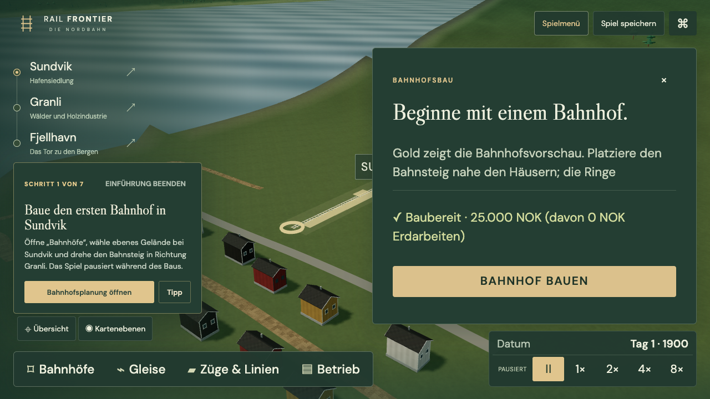
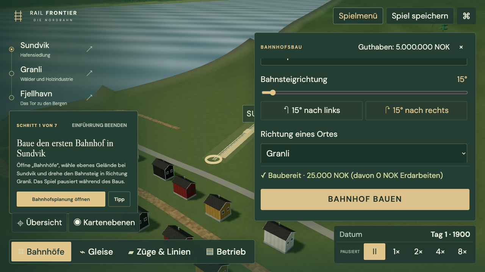

# Erweiterte Spiel- und Fehlbedienungsprüfung — 22. September 2026

Abgeschlossen: 18 Prüfrollen, 13 korrigierte Fehlergruppen, 224 Kernprüfungen und 49 unterschiedliche Browserfälle bestanden. Ressourcenprüfung abgeschlossen. Ausgangsversion `fb5f666`, unveränderter Testbuild auf Port 5190. Korrekturen wurden anschließend mit einem separat gebauten Stand geprüft.

## Umfang und Grenzen

18 Prüfrollen: zehn Spielerperspektiven, vier gezielte Fehlbedienungsrollen und vier kritische UX-Reviews. Elf neue Agenten-Aufgaben konnten gestartet werden; danach verhinderte das Werkzeug weitere Aufgaben (`agent thread limit reached`). Sieben Rollen verwenden abgeschlossene Agenten erneut, mit frischen Browsern und eigenen Berichten. Höchstens drei Browser gleichzeitig. Es handelt sich um simulierte Perspektiven, nicht um Tests mit echten Zehn- oder Siebzigjährigen oder echte Zeitschriftenbewertungen.

Die ersten Spielstarts erfolgen über die Oberfläche. Fortgeschrittene Prüfungen nennen vorbereitete Bahnen, Eingriffstests und reine Modellprüfungen ausdrücklich. Fehler im Testskript zählen nicht als Spielfehler. Kein Bericht wird als Beleg für nicht erreichte Spielstufen verwendet. Kalendergrenzen bis 2000 sind keine durchgespielten Jahrhunderte; Arizona bleibt eine Landschaftsstudie.

## Triage

Der Koordinator führt doppelte Meldungen zusammen, prüft ihre Ursache und priorisiert reale Auswirkungen. Ein Verlust gespeicherter Gesellschaften blockiert die Freigabe dieser Runde. Verständlichkeit, erreichbare Bedienelemente und korrekte Statusanzeigen werden korrigiert. Kleine Textreste und nur einmal beobachtete Komforteffekte bleiben mit Begründung dokumentiert. Die vollständige Zuordnung steht in [FINDINGS.md](FINDINGS.md); Rohberichte behalten abweichende Bewertungen und Einschränkungen.

## Validierung

224 Kernprüfungen und Produktionsbuild bestanden. Die erste gezielte Browserprüfung bestand 5/6; der einzige Fehler verglich `-0` vor JSON mit `0` nach JSON. Die gespeicherte Bahn war intakt. Nach kanonischem Vergleich und drei ergänzten Fällen bestand die nächste Runde 9/9. Anschließend wurden schmale 150%-Bedienung und die Produktionsanzeige ergänzt. Der vollständige Durchlauf bestand 48/49 in 10,8 Minuten. Der letzte neue Test suchte den bestehenden Eigennamen „Sundvik Sawmill“ fälschlich als „Sägewerk“; die deutsche Fehlmaterialanzeige war bereits korrekt. Nur der Selektor wurde korrigiert. Der betroffene Browserfall bestand anschließend 1/1 auf unverändertem Anwendungscode. Damit sind alle 49 unterschiedlichen Browserfälle nachgewiesen; kein automatischer Retry und keine Behauptung eines fehlerfreien 49/49-Gesamtlaufs.

Fünf neue Kernprüfungen und elf neue Browserfälle ergänzen bestehende Abdeckung; der vorhandene Test für veraltete Planungsantworten gehört jetzt ebenfalls zur Abnahmesuite. Der Frachtfall prüft zusätzlich die tatsächliche Ladungsanzeige. Eine abschließende Einzelprüfung des Industrie-Status-Tests bestand nach Präzisierung seines Lager-Fallbeispiels ebenfalls.

Maschinenlesbar: [validation.json](validation.json). Lokale Protokolle: `artifacts/swarm/core-final.txt`, `production-final.txt`, `acceptance-final.txt`, `industry-followup.txt`; kompletter erster HTML-Bericht unter `artifacts/swarm/full-acceptance-report/`, korrigierter Einzelbericht unter `artifacts/acceptance/report/`. Der Produktionsbuild hat nur den bereits bekannten Hinweis zur Bündelgröße.

[S07-Einzelprüfung](coordinator-responsiveness.md): drei Züge, 1×/8×/Zugverfolgung, 12 normale Klicks in 29–421 ms. Die unter drei parallelen Browsern beobachteten Timeouts ließen sich nicht wiederholen. Kein vorsorglicher Eingriff in die Simulation.

Nicht geprüft: echte Kinder/ältere Testpersonen, Safari/Firefox, Screenreader/Voice-Control, reale Touchgeräte, Stromausfall, viele Browser-Tabs mit gemeinsamen Schreibzugriffen, ausbalancierte Jahrhunderte oder reale Mehrgleisbahnhöfe.

## Was korrigiert wurde

- Gespeicherte Gesellschaften bleiben bei einem Wechsel in eine Übung oder andere Firma archiviert. Sicherungsfehler verhindern den Wechsel. Gespeicherte Dokumente einschließlich Gleisentwurf werden kopiert; verworfene ungespeicherte Änderungen werden nicht heimlich gespeichert.
- Große/kleine Fenster: Ziele und Uhr überlagern sich nicht mehr; Bahnhofseinstellungen erhalten nutzbaren Scrollraum, relevante Archiv-/Betriebstexte skalieren, Guthaben bleibt in Bau-/Betriebsfenstern sichtbar.
- Unmögliche physische Bahnhofserweiterungen werden vor dem Kauf erklärt. Bestehende Linien können gezielt zur Verwaltung ausgewählt werden; fahrende Züge werden dabei nicht versetzt.
- Güterzüge zeigen ihre tatsächliche Ladung. Das Sägewerk erklärt fehlendes Holz oder ein volles Lager und zeigt das reale Rezept.
- Der erste geführte Streckenbau rahmt beide Bahnhöfe ein. Ablehnungen stehen bei der fehlgeschlagenen Aktion mit erhaltenem Entwurf. Betriebs- und Zugansicht wechseln direkt.

Vorher, 1280×720 / 150%: fast der gesamte Bahnhofsdialog besteht aus Titel und Kaufleiste.

Nachher: nutzbare Drehregler, verbleibendes Guthaben und erreichbare Kaufleiste. Die Aufnahme ist absichtlich zum Richtungsabschnitt gescrollt.

## Nächste Bahnhofsmerkmale

[STATION_EXPANSION_AND_YARDS.md](../../construction/STATION_EXPANSION_AND_YARDS.md) plant echte zusätzliche Bahnsteiggleise, Weichen und Gleisbelegung, Abstellgleise, Wagenbestand/Zugumbildung sowie ergänzende oder eigenständige Güterbereiche. Diese Runde implementiert diese größeren Systeme nicht. Sie verhindert zunächst irreführende Ausbaubestellungen, deren längerer Bahnsteig noch nicht physisch gebaut werden kann.

## Aufräumen

Abgeschlossen: alle erzeugten Browser/Prüfprozesse geschlossen, Vergleichsserver 5190 und bisheriger Devserver 5173 beendet; Abnahmeserver 5180 automatisch beendet. Abschlussprüfung findet auf allen drei Ports keine Listener und keine Projekt-Test-/Headless-Browserprozesse. Temporäre Testbuilds entfernt; Berichte/Belege behalten. [Ressourcen-Audit](CLEANUP.md).

Normale Benutzer-Tabs und fremde Anwendungen bleiben unberührt. Zum erneuten Spielen im Projekt `npm run dev -- --host 127.0.0.1` starten. Nächste Produktarbeit: LIV-01 verlässliche Orts-/Bahnhofszugänge, dann STX-01 physischer Bahnhofsausbau; kleine dokumentierte P3-Punkte gezielt bündeln.
