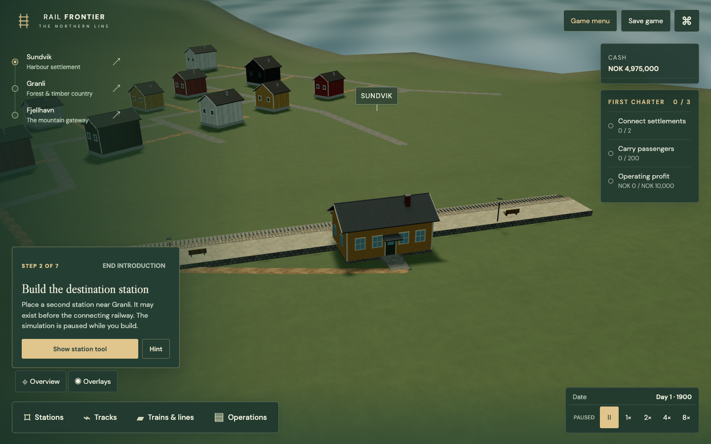
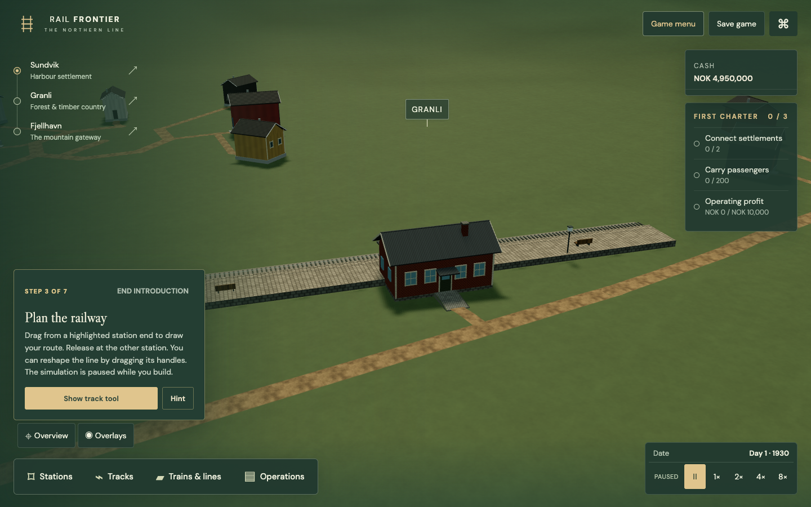
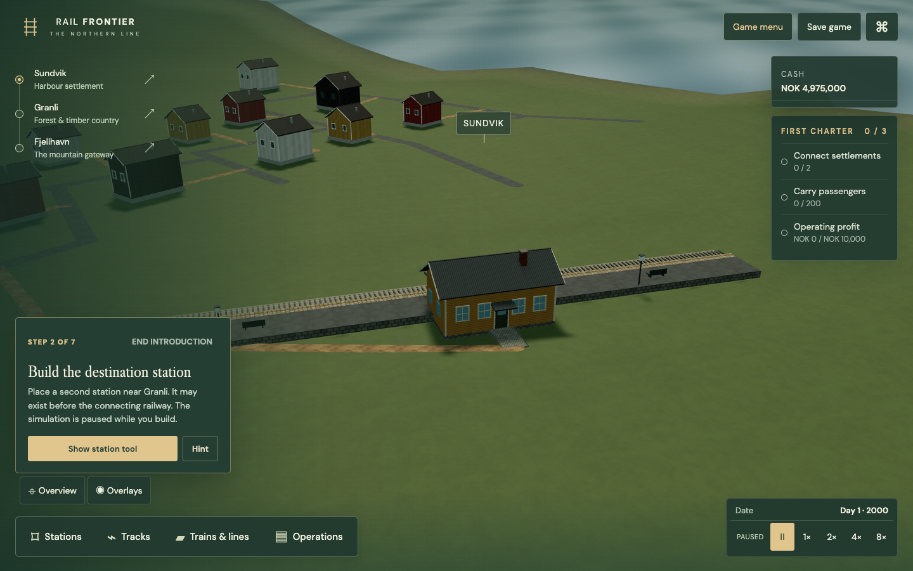
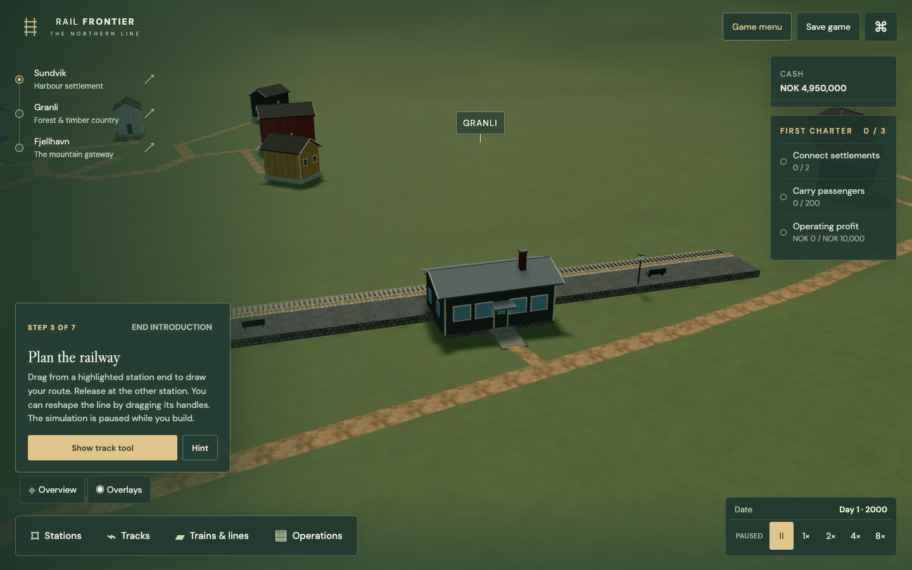
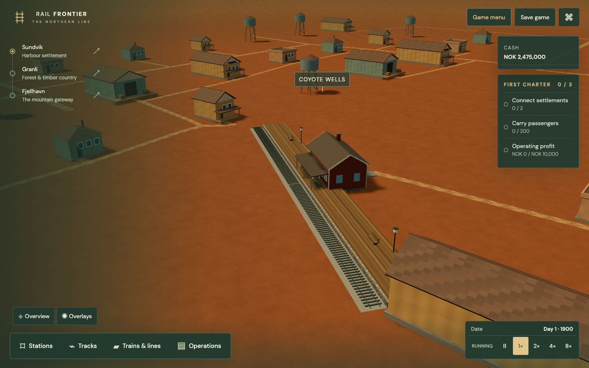
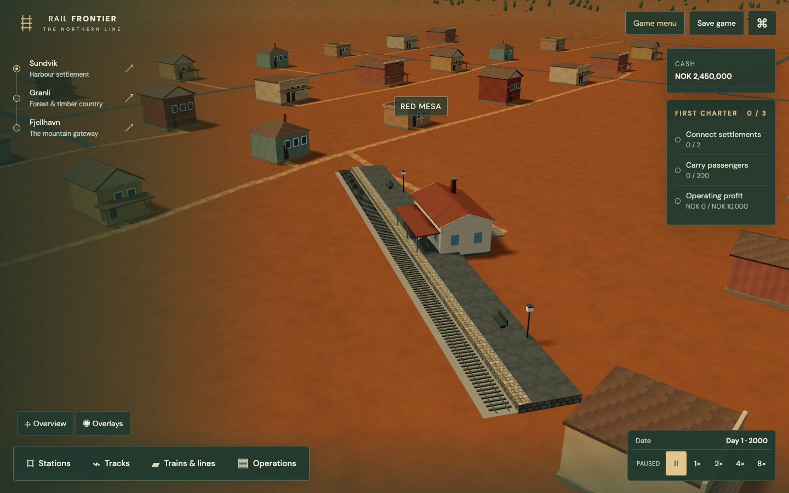

# Regional roads, platforms and station architecture

Implemented 2026-09-22, as a visual refinement of LIV-01b. Resume LIV-01c next.

## What changes in play

Roads now use original colour, normal and roughness tiles with a four-metre repeat, mipmaps and moderate anisotropy. Cobbles, earth, asphalt and gravel are distinct. Footpaths, farm lanes and station approach paths stay dirt; a later town street does not turn every rural path into asphalt. Existing checked routes and rounded junctions remain the source of road geometry.

Platforms retain their full saved length, rail clearance and engineering height. Their surfaces now have a coping edge, a separate walking strip, textured retaining masonry, benches and period furniture. The later safety strip is a visual cue, not a claim of compliance with a particular accessibility standard.

| Presentation period | Norway streets / platforms | Arizona streets / platforms | Newly built station |
| --- | --- | --- | --- |
| Before 1920 | Cobbles / gravel | Dirt / timber boards | Ochre timber in Norway; brick depot in Arizona |
| 1920–1959 | Cobbles / pavers | Gravel / pavers | Brick in Norway; warm plaster and tiled roof in Arizona |
| From 1960 | Asphalt / asphalt with paved walking edge | Asphalt / asphalt with paved walking edge | Dark timber and larger windows in Norway; pale plaster and larger windows in Arizona |
| From 1980 | Additional light platform safety strip | Additional light platform safety strip | Retains the post-1960 family |

These are broad **art-direction periods**, not universal historical conversion dates. Local materials and historic buildings often persist. An existing station keeps its original architectural family while surfaces and furniture modernise. The three building families are original regional composites, not replicas of named stations. They share a fixed footprint and entrance contract. Larger classes still use that building family; physically distinct large stations, multiple platforms, sidings and freight modules remain STX work.

Blender 4.0.2 generated twelve GLBs: three periods × two regions × two detail levels. Pitched roofs, closed gables, roof-edge trim, chimneys, canopies and supporting posts replace the old flat box. Windows, frames and glazed doors have geometry; wood boarding, brick, plaster and roof finishes have original embedded colour/normal textures. Placement previews clone the corresponding building, so its silhouette agrees with the purchase.

## Actual game captures

Norway, 1900: timber station, gravel platform and cobbled town streets.

A new Norway station in 1930: brick facade and paved platform. Granli's rural approach stays unpaved.

The original 1900 Norway building in a dated 2000 save: the building remains timber, while the town street and platform surface have changed.

A new Norway building in 2000 has a lower pitched roof and larger windows.

Arizona art fixture, 1900: brick depot, timber platform and dusty paths.

Arizona art fixture, new building in 2000: pale plaster and a later platform finish.

**Arizona is still a scenery study.** The art test deliberately exposes the existing construction controls inside its isolated browser fixture. These pictures validate the regional assets; their visible company UI is not an announcement of a playable Arizona campaign.

## References and authorship

- [Norsk jernbanemuseum, Store norske leksikon](https://snl.no/Norsk_jernbanemuseum): images of historic railway buildings, including the timber Kløften station, informed the Norwegian palette, trim and pitched-roof proportions.
- [Kløfta, Bane NOR](https://www.banenor.no/reise-og-trafikk/stasjoner/-k-/klofta/): the original building's preservation at the railway museum supports retaining older architecture as game years advance.
- [Grand Canyon Train Depot, National Park Service](https://home.nps.gov/places/000/train-depot.htm): the 1909–1910 log and timber-frame building is a regional counterexample to assuming all Arizona stations are plain adobe boxes. Its unusual log construction is not treated as a universal Arizona style or copied as this game's brick depot.
- [Flagstaff Railroad Depot, SAH Archipedia](https://sah-archipedia.org/buildings/AZ-01-005-0062) and [Flagstaff self-guided tours](https://www.flagstaffarizona.org/things-to-do/tours/self-guided/): depot imagery informed the use of pitched roofs and substantial regional masonry buildings.

Reference photographs are not shipped as textures. All new models and tiles are generated originals under the repository's existing license.

## Reproduction and compatibility

- Generator: `tools/blender/generate_station_architecture.py`. Run with local Blender in background mode after either base regional generator. Both base generators preserve these separately owned station entries. Temporary PNG sources go to ignored `artifacts/station-textures/`; runtime GLBs embed the textures.
- Era policy: `src/world/settlement-era.ts`. A built station's architecture comes from its original negative `Station construction` ledger entry, excluding upgrade receipts. Prebuilt/legacy stations without a receipt use the campaign's starting year. **Any future ledger compaction must preserve that origin or migrate it to an explicit field.** No save-schema change is made here; schema 11 stays current.
- Renderer: `settlement-materials.ts`, `settlement-roads.ts`, `station-platform.ts` and `fjord-renderer.ts`. Material updates occur at presentation-era boundaries. Existing public entrance, foundation, road clearance, rail position, train envelope and saved station footprint remain unchanged. Cash, fares, catchment and routing are unchanged.
- Asset validation includes embedded station images as well as external tiles: approximately 19 MiB for the Norway pack and 24 MiB for Arizona, including mip estimates and identical station maps shared across LODs. These numbers are texture estimates, not total process/GPU memory. Station GLBs total about 3.65 MB and 4.00 MB respectively. All models fit declared triangle/material/file-size budgets. Runtime-generated surface tiles are separately cached, with at most seven kinds × two palettes × three 256² RGBA maps, approximately 14 MiB including mips if every combination is used.

## Validation and limits

Final application checks: **234 core tests**, TypeScript, production build, asset validation and **6/6 focused Chrome journeys** pass. The existing large-bundle advisory remains.

- Two new regional journeys purchase a real station, import dated valid saves through the public save UI, inspect 1900/1930/2000 finishes, cross 1959→1960 through normal simulation time, build the later architectural variants, and save/reload a modern station. They assert unchanged railway geometry at the surface transition and collect browser errors. Arizona uses the explicit art-fixture exception above.
- Existing German/English access journeys verify the preview against construction and reload. The cancellation/failure/retry journey verifies stale-worker rejection. The track/platform journey verifies rails clear the terrain before/after reload.
- New core checks cover fixed platform bounds, distinct repeated textures, construction-year provenance, roof ridges, public-door sockets, textured walls and both LODs for all six station families.
- Earlier run: 5/6 browser cases passed; the Arizona test timed out because it attempted to click controls intentionally hidden by scenery-study mode. The fixture was corrected without exposing those controls in production. The first corrected regional run passed 2/2. After adding construction-era variants and LOD texture sharing, the complete final six-case sweep passed without retries. Initial core suite had 233 cases; the additional construction-year test brings the final total to 234.
- Images were inspected in the actual browser renderer. The first masonry pass had excessive dark seam contrast; it was softened before the final captures. No full browser suite, new frame-rate benchmark, Safari/Firefox certification, human accessibility trial or multi-century balance result is claimed.

Test output stays in ignored `artifacts/regional-stations/`. Test browsers and the isolated server are stopped after the sweep; the generated acceptance site is removed from the workspace. The ordinary development preview remains stopped at the user's request.
