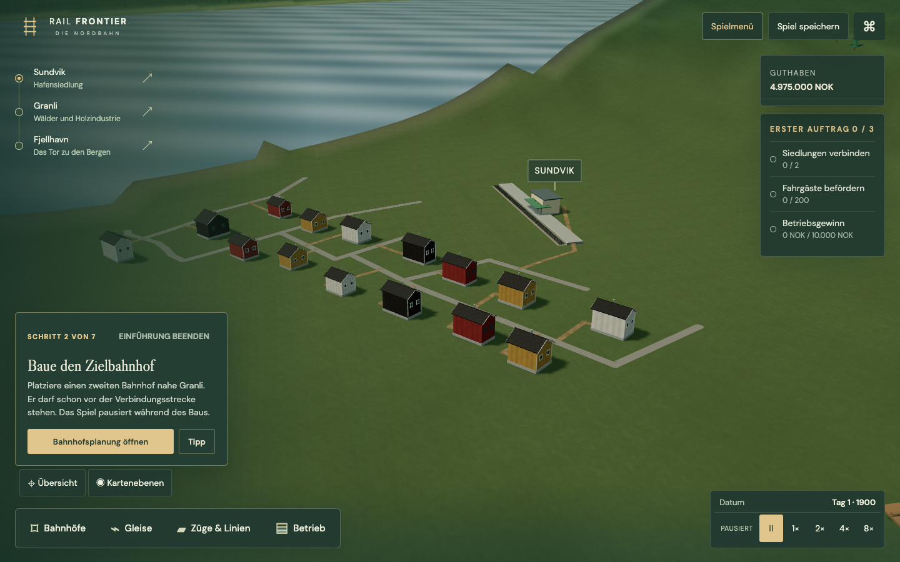
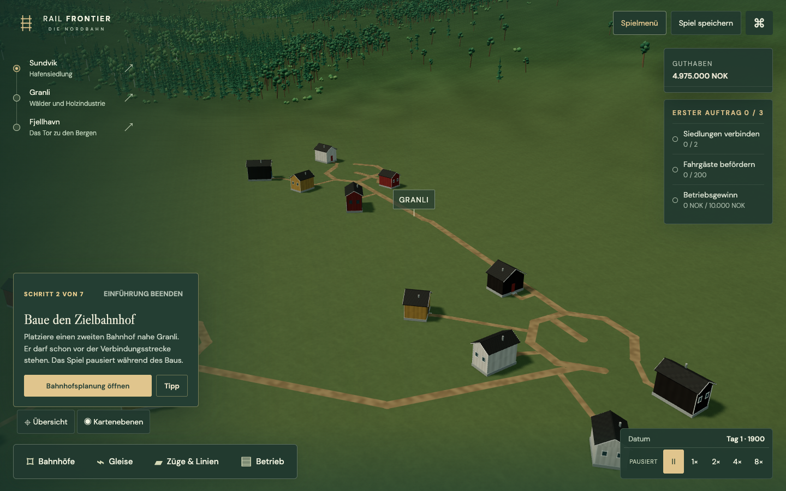
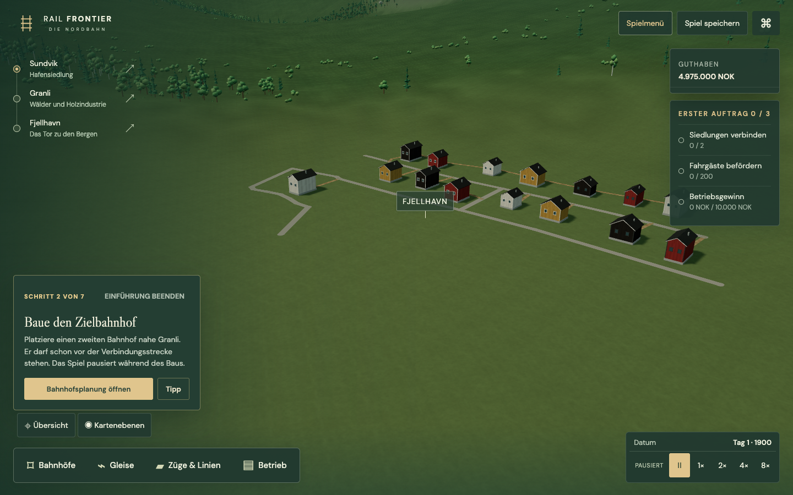
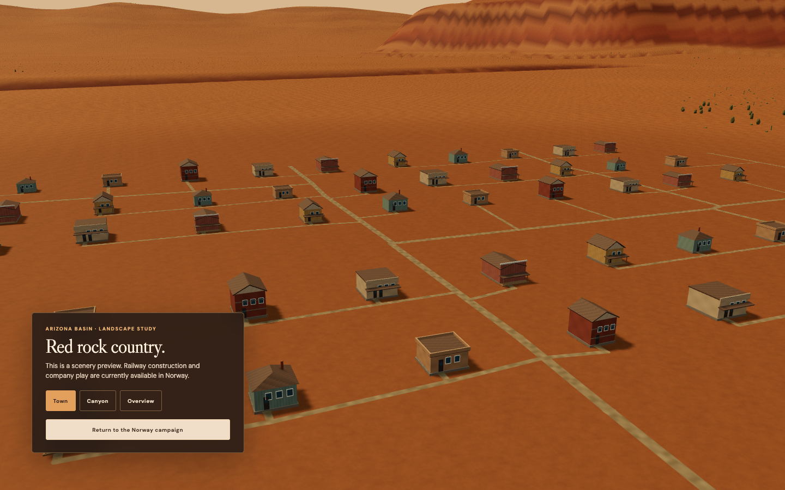

# Connected settlement paths — LIV-01a

22 September 2026. First implemented part of LIV-01; this does not complete the living-settlement or station-expansion plans.

## Implemented contract

- A single deterministic path generator now connects the existing harbour rows, farm courts and Arizona street blocks. The previous renderer no longer clips out road pieces when a house overlaps them.
- Entrance positions come from the actual LOD0 door/threshold meshes and footprint markers in the authored GLB files. Building rotation and scale apply to both the entrance and its obstacle. Buildings without an authored door remain obstacles; they are not falsely counted as occupied homes.
- The public station entrance is on the building side opposite the platform. It has a visible door and canopy. Its connection uses the saved orientation and the existing town association.
- Local paths check the whole corridor against oriented building footprints, terrain slope, water and rail centre-lines. A bounded deterministic search detours around obstacles. It does not create implicit rail crossings. Conservative rejection is preferable to drawing a path through a railway.
- Validated polylines are rendered continuously, with rounded joins, ground-conforming surfaces and consistent world-space texture coordinates. Street surfaces use cobbles/dirt initially and asphalt from the existing 1950 presentation threshold; farm lanes, house and station approaches remain dirt. Geometry batches by surface and width rather than creating a draw call for every doorstep.
- The station inspector reports connected, blocked or no nearby town network in German and English. It explicitly says this is visual access; catchment, demand, revenue and construction costs remain unchanged.
- Railway and terrain rebuilds revalidate the derived paths. Save/reload reconstructs the same geometry without a save-schema change. No additional background simulation runs for these paths.

## Scope and limits

New Norway companies connect all 45 residential entrances in the tested starting world. Arizona connects the buildings with authored doors; water towers and mine headframes are not residential entrances. Existing railways can divide settlements into disconnected areas. The generator reports that state rather than silently painting a crossing. The search is local (nearest connection at most 650 m, 18,000 expanded cells); “blocked” means no safe connection was found within those limits, not a mathematical proof that none exists anywhere.

The existing authored door meshes provide entrance metadata now. Dedicated Blender navigation sockets, graded forecourts/steps, explicit graph junction IDs, safe crossing structures, preview-time access review and priced road construction remain LIV-01b. There are no moving residents or animals yet. The conservative rail obstacle also excludes routes beneath elevated tracks or above tunnels until explicit crossing clearance exists. Existing decorative settlement placement can change with railway geometry; this is not a saved parcel-ownership system.

## Validation

- 227 core checks passed after the path integration (224 existing plus three new path tests).
- Six targeted geometry/path/migration checks passed after batching the road geometry.
- Production build passed; the existing bundle-size advisory remains.
- Eight distinct browser cases verified across construction, four tutorial journeys, station/terrain continuity and two new settlement journeys. The first expanded run passed 7/8; a screenshot wait incorrectly expected an opacity-hidden toast to have `display:none`. The corrected follow-up then exposed an actual missing-translation defect in the new access labels. Locale messages were moved into the proper message dictionaries. Four relevant cases subsequently passed, including German and English station inspection. Both settlement cases passed again after dirt texture filtering, and the Norway case was repeated after keeping farm lanes unpaved.
- Browser tests build a rotated station through the UI, check all starting residential accesses, save/reload the exact derived network, read the localized inspector and check Arizona entrances. No automatic retries or claim of a single final full-suite run. Existing cross-browser/human accessibility gates remain open.
- Logs: ignored `artifacts/liv-01a/` contains core/build outputs, the first expanded browser run, the localization failure and successful follow-ups.

The spatially indexed obstruction checks replaced an initially slow full-network scan during development. No frame-rate or cross-device performance guarantee is claimed. Test servers and headless browsers are closed after validation; diagnostic logs remain under ignored `artifacts/`.

## Next

LIV-01b: preview the access before buying, grade an explicit station forecourt, retain navigable junction/entrance contracts and decide how a newly built railway cuts a public path. Only then attach LIV-02 representative people or change passenger eligibility. STX-01 station expansions must use the same public-side access contract.

## Verified views

Sundvik: a public-side station path and individual door approaches.

Granli: unpaved farm lanes and courtyard approaches.

Fjellhavn: connected terrace rows.

Arizona: local street blocks and authored shop/house entrances.

